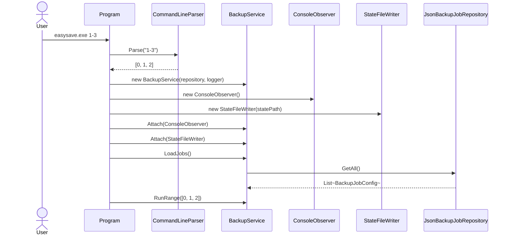
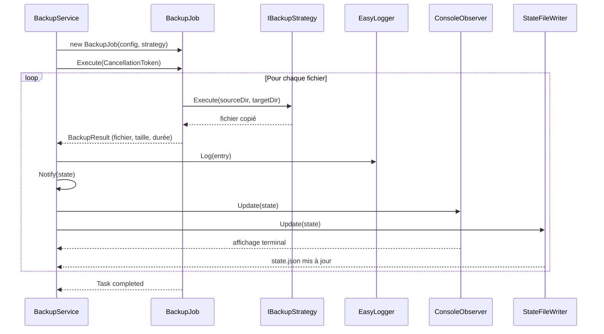

# EasySave v1.0 — Dossier de conception

> Document de justification des choix d'architecture pour le livrable 1.
> Application console, backups séquentiels. Conçue pour absorber v2 (GUI) et v3 (parallèle) sans réécriture.

---

## Table des matières


1. [Diagramme de classes](#2-diagramme-de-classes)
2. [Diagramme de séquence](#3-diagramme-de-séquence)
3. [Choix de conception](#4-choix-de-conception)

---


## 1. Diagramme de classes

```mermaid
classDiagram

    %% ─────────────────────────────────────────
    %% PACKAGE: EasyLog.dll
    %% ─────────────────────────────────────────
    namespace EasyLog {
        class LogEntry {
            +DateTime Timestamp
            +string BackupName
            +string SourcePath
            +string DestPath
            +long FileSize
            +long TransferMs
        }

        class EasyLogger {
            -string _logDirectory
            -object _lock
            +EasyLogger(logDirectory string)
            +Log(entry LogEntry) void
            -GetDailyFilePath() string
        }
    }

    EasyLogger --> LogEntry : uses

    %% ─────────────────────────────────────────
    %% PACKAGE: EasySave.Models
    %% ─────────────────────────────────────────
    namespace EasySave_Models {
        class BackupType {
            <<enumeration>>
            Full
            Differential
        }

        class BackupJobConfig {
            +string Name
            +string SourceDir
            +string TargetDir
            +BackupType Type
            +bool IsActive
        }

        class BackupState {
            +string Name
            +DateTime LastActionTime
            +string Status
            +int TotalFiles
            +long TotalSize
            +int RemainingFiles
            +long RemainingSize
            +float Progress
            +string CurrentSource
            +string CurrentDest
        }
    }

    BackupJobConfig --> BackupType : uses

    %% ─────────────────────────────────────────
    %% PACKAGE: EasySave.Services
    %% ─────────────────────────────────────────
    namespace EasySave_Services {

        class IStateObserver {
            <<interface>>
            +Update(state BackupState) void
        }

        class IStateSubject {
            <<interface>>
            +Attach(observer IStateObserver) void
            +Detach(observer IStateObserver) void
            +Notify(state BackupState) void
        }

        class StateFileWriter {
            -string _statePath
            -object _lock
            +StateFileWriter(statePath string)
            +Update(state BackupState) void
        }

        class IBackupStrategy {
            <<interface>>
            +Execute(sourceDir string, targetDir string) void
        }

        class FullBackupStrategy {
            +Execute(sourceDir string, targetDir string) void
        }

        class DifferentialBackupStrategy {
            +Execute(sourceDir string, targetDir string) void
        }

        class IBackupJobRepository {
            <<interface>>
            +GetAll() IEnumerable~BackupJobConfig~
            +Save(jobs IEnumerable~BackupJobConfig~) void
        }

        class JsonBackupJobRepository {
            -string _configPath
            +JsonBackupJobRepository(configPath string)
            +GetAll() IEnumerable~BackupJobConfig~
            +Save(jobs IEnumerable~BackupJobConfig~) void
        }

        class BackupJob {
            -BackupJobConfig _config
            -IBackupStrategy _strategy
            +BackupJob(config, strategy)
            +Execute(ct CancellationToken) Task~BackupResult~
        }

        class BackupService {
            <<Facade>>
            -List~BackupJob~ _jobs
            -List~IStateObserver~ _observers
            -IBackupJobRepository _repository
            -EasyLogger _logger
            +BackupService(repository, logger)
            +Attach(observer IStateObserver) void
            +Detach(observer IStateObserver) void
            +Notify(state BackupState) void
            +LoadJobs() void
            +RunJob(index int) Task
            +RunRange(indices IEnumerable~int~) Task
            +AddJob(config BackupJobConfig) void
            +GetJobs() IEnumerable~BackupJobConfig~
        }
    }

    StateFileWriter ..|> IStateObserver : implements
    IStateSubject --> IStateObserver : notifies
    FullBackupStrategy ..|> IBackupStrategy : implements
    DifferentialBackupStrategy ..|> IBackupStrategy : implements
    JsonBackupJobRepository ..|> IBackupJobRepository : implements
    BackupJob --> IBackupStrategy : uses
    BackupService ..|> IStateSubject : implements
    BackupService --> BackupJob : instantiates
    BackupService --> IBackupJobRepository : reads/writes
    BackupService --> IStateObserver : notifies
    BackupService --> EasyLogger : logs

    %% ─────────────────────────────────────────
    %% PACKAGE: EasySave (Console App)
    %% ─────────────────────────────────────────
    namespace EasySave_Console {
        class Program {
            +Main(args string[]) void
        }

        class CommandLineParser {
            +Parse(args string[]) IEnumerable~int~
        }

        class ConsoleObserver {
            +Update(state BackupState) void
        }
    }

    ConsoleObserver ..|> IStateObserver : implements
    Program --> CommandLineParser : uses
    Program --> BackupService : calls
```



---

## 2. Diagramme de séquence

### 2.1 Démarrage et injection des observers



### 2.2 Exécution d'un job (séquentiel v1)



---

## 3. Choix de conception

### 3.1 Facade — `BackupService`

**Décision** : `BackupService` est le seul point d'entrée pour la couche console et, demain, pour la GUI.

**Justification** : toute la coordination (chargement des jobs, exécution, log, notification d'état) passe par un unique point de contrôle. La console et la GUI n'ont pas à connaître les classes internes. En v2, on branche une GUI sur `BackupService` sans rien modifier dans les Services.

---

### 3.2 Observer — `IStateSubject` / `IStateObserver`

**Décision** : `BackupService` implémente `IStateSubject` et notifie les observers enregistrés (`ConsoleObserver`, `StateFileWriter`). Les observers sont injectés par `Program` via `Attach()`.

**Justification** : l'affichage temps réel (fichier par fichier) est nécessaire dès v1 et doit fonctionner en v3 parallèle. Le pattern Observer découple la source des événements (le backup) de leur consommation (terminal, fichier, futur réseau). La console passe uniquement par la Facade — elle n'interagit jamais directement avec `IStateSubject`.

**Point important** : `BackupJob` ne notifie pas lui-même les observers. Il remonte un `BackupResult` à la Facade, qui centralise la notification. Cela évite les appels concurrents non coordonnés vers les observers en v3.

---

### 3.3 Strategy — `IBackupStrategy`

**Décision** : `FullBackupStrategy` et `DifferentialBackupStrategy` implémentent `IBackupStrategy`. La stratégie est injectée dans `BackupJob` à sa construction.

**Justification** : le type de backup (Full vs Differential) est une dimension variable indépendante du reste de l'orchestration. Swapper la stratégie ne nécessite aucune modification de `BackupJob` ni de `BackupService`. En v3, chaque `BackupJob` parallèle porte sa propre stratégie sans partage d'état.

---

### 3.4 Repository — `IBackupJobRepository`

**Décision** : `JsonBackupJobRepository` implémente `IBackupJobRepository`. Le repository est injecté dans `BackupService`.

**Justification** : la persistance de la configuration est abstraite derrière une interface. En v2, on peut passer à une base de données ou un autre format sans toucher à `BackupService`. Le repository reste sur la Facade car `BackupJob` n'a pas à savoir d'où vient sa configuration — il reçoit un `BackupJobConfig` déjà construit.

---

### 3.5 `BackupJob` — unité parallélisable

**Décision** : `BackupJob` ne porte que `BackupJobConfig` et `IBackupStrategy`. `Execute()` prend un `CancellationToken`.

**Justification** : pour la parallélisation en v3, chaque `BackupJob` doit être une unité de travail **isolée et sans état partagé**. Retirer `EasyLogger` et `IStateSubject` de `BackupJob` supprime les deux principales sources de race conditions. Le `CancellationToken` permet d'annuler un job individuel sans interrompre les autres.

---

### 3.6 `LogEntry` — placement dans `EasySave.Models`

**Décision** : `LogEntry` reste dans `EasyLog.dll`.

**Justification** : `EasyLog.dll` est conçu pour être une dll autonome sans dépendance externe, réutilisable sur d'autres projets. Si `LogEntry` migrait dans `EasySave.Models`, la dll serait couplée au projet. Le compromis accepté est que `LogEntry` ne bénéficie pas de la colocation avec les autres modèles.

---

## Règle d'or des dépendances

```
EasySave.exe (Console)
    └── EasySave.Services.dll
            ├── EasySave.Models.dll
            └── EasyLog.dll

EasySave.Models.dll  ──► aucune dépendance interne
EasyLog.dll          ──► aucune dépendance interne
```

---

## Récapitulatif des décisions

| # | Élément | Décision | Impact v3 (parallèle) |
|---|---|---|---|
| 1 | `BackupService` | Facade — seul point d'entrée | Inchangé |
| 2 | `ConsoleObserver` | Injecté via `Attach()` sur la Facade | Inchangé |
| 3 | `EasyLogger` | Sur la Facade, pas sur `BackupJob` | Évite les race conditions d'écriture |
| 4 | `IStateSubject` | Sur la Facade, pas sur `BackupJob` | Évite les notifications concurrentes |
| 5 | `CancellationToken` | Ajouté à `BackupJob.Execute()` | Annulation individuelle par job |
| 6 | `IBackupStrategy` | Sur `BackupJob` | Chaque job parallèle porte sa propre stratégie |
| 7 | `IBackupJobRepository` | Sur la Facade | `BackupJob` reçoit sa config déjà construite |
| 8 | `LogEntry` | Dans `EasyLog.dll` | `EasyLog.dll` reste autonome et réutilisable |
