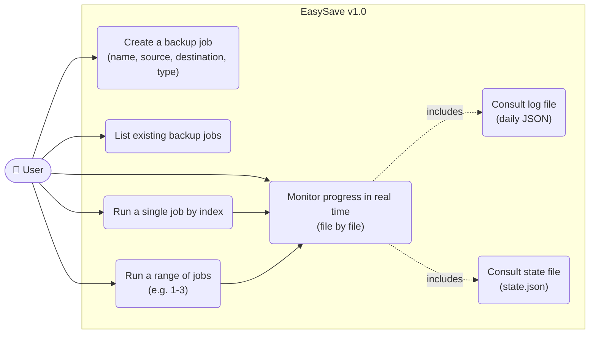
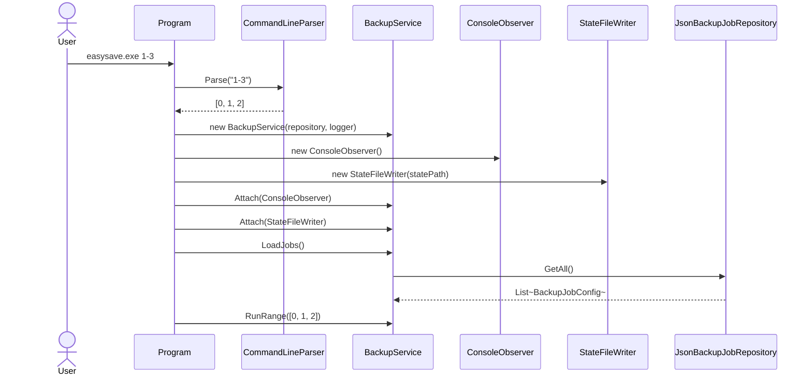
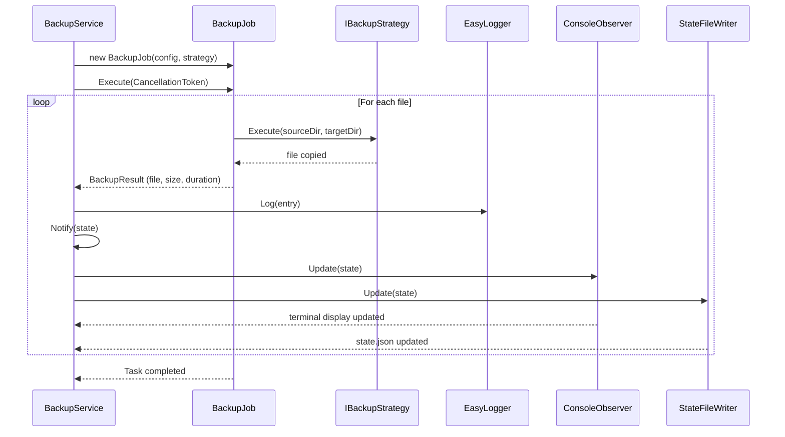

# EasySave v1.0 — Design Document

> Livrable 1 — Console application, sequential backups only.
> Designed to absorb v2 (GUI) and v3 (parallel) without rewriting existing code.

---

## Table of Contents

1. [Use Case Diagram](#1-use-case-diagram)
2. [Class Diagram](#2-class-diagram)
3. [Sequence Diagrams](#3-sequence-diagrams)
4. [Design Decisions](#4-design-decisions)

---

## 1. Use Case Diagram



---

## 2. Class Diagram

```mermaid
classDiagram

    %% ─────────────────────────────────────────
    %% PACKAGE: EasyLog.dll
    %% ─────────────────────────────────────────
    namespace EasyLog {
        class LogEntry {
            +DateTime Timestamp
            +string BackupName
            +string SourcePath
            +string DestPath
            +long FileSize
            +long TransferMs
        }

        class EasyLogger {
            -string _logDirectory
            -object _lock
            +EasyLogger(logDirectory string)
            +Log(entry LogEntry) void
            -GetDailyFilePath() string
        }
    }

    EasyLogger --> LogEntry : uses

    %% ─────────────────────────────────────────
    %% PACKAGE: EasySave.Models
    %% ─────────────────────────────────────────
    namespace EasySave_Models {
        class BackupType {
            <<enumeration>>
            Full
            Differential
        }

        class BackupJobConfig {
            +string Name
            +string SourceDir
            +string TargetDir
            +BackupType Type
            +bool IsActive
        }

        class BackupState {
            +string Name
            +DateTime LastActionTime
            +string Status
            +int TotalFiles
            +long TotalSize
            +int RemainingFiles
            +long RemainingSize
            +float Progress
            +string CurrentSource
            +string CurrentDest
        }
    }

    BackupJobConfig --> BackupType : uses

    %% ─────────────────────────────────────────
    %% PACKAGE: EasySave.Services
    %% ─────────────────────────────────────────
    namespace EasySave_Services {

        class IStateObserver {
            <<interface>>
            +Update(state BackupState) void
        }

        class IStateSubject {
            <<interface>>
            +Attach(observer IStateObserver) void
            +Detach(observer IStateObserver) void
            +Notify(state BackupState) void
        }

        class StateFileWriter {
            -string _statePath
            -object _lock
            +StateFileWriter(statePath string)
            +Update(state BackupState) void
        }

        class IBackupStrategy {
            <<interface>>
            +Execute(sourceDir string, targetDir string) void
        }

        class FullBackupStrategy {
            +Execute(sourceDir string, targetDir string) void
        }

        class DifferentialBackupStrategy {
            +Execute(sourceDir string, targetDir string) void
        }

        class IBackupJobRepository {
            <<interface>>
            +GetAll() IEnumerable~BackupJobConfig~
            +Save(jobs IEnumerable~BackupJobConfig~) void
        }

        class JsonBackupJobRepository {
            -string _configPath
            +JsonBackupJobRepository(configPath string)
            +GetAll() IEnumerable~BackupJobConfig~
            +Save(jobs IEnumerable~BackupJobConfig~) void
        }

        class BackupJob {
            -BackupJobConfig _config
            -IBackupStrategy _strategy
            +BackupJob(config, strategy)
            +Execute(ct CancellationToken) Task~BackupResult~
        }

        class BackupService {
            <<Facade>>
            -List~BackupJob~ _jobs
            -List~IStateObserver~ _observers
            -IBackupJobRepository _repository
            -EasyLogger _logger
            +BackupService(repository, logger)
            +Attach(observer IStateObserver) void
            +Detach(observer IStateObserver) void
            +Notify(state BackupState) void
            +LoadJobs() void
            +RunJob(index int) Task
            +RunRange(indices IEnumerable~int~) Task
            +AddJob(config BackupJobConfig) void
            +GetJobs() IEnumerable~BackupJobConfig~
        }
    }

    StateFileWriter ..|> IStateObserver : implements
    IStateSubject --> IStateObserver : notifies
    FullBackupStrategy ..|> IBackupStrategy : implements
    DifferentialBackupStrategy ..|> IBackupStrategy : implements
    JsonBackupJobRepository ..|> IBackupJobRepository : implements
    BackupJob --> IBackupStrategy : uses
    BackupService ..|> IStateSubject : implements
    BackupService --> BackupJob : instantiates
    BackupService --> IBackupJobRepository : reads/writes
    BackupService --> IStateObserver : notifies
    BackupService --> EasyLogger : logs

    %% ─────────────────────────────────────────
    %% PACKAGE: EasySave.Localization
    %% ─────────────────────────────────────────
    namespace EasySave_Localization {

        class ILocalizationService {
            <<interface>>
            +Get(key string) string
        }

        class ResourceLocalizationService {
            -string _culture
            +ResourceLocalizationService(culture string)
            +Get(key string) string
        }
    }

    ResourceLocalizationService ..|> ILocalizationService : implements

    %% ─────────────────────────────────────────
    %% PACKAGE: EasySave (Console App)
    %% ─────────────────────────────────────────
    namespace EasySave_Console {

        class Program {
            +Main(args string[]) void
        }

        class CommandLineParser {
            +Parse(args string[]) IEnumerable~int~
        }

        class CommandLineRunner {
            -BackupService _service
            -CommandLineParser _parser
            +Run(args string[]) Task
        }

        class InteractiveShell {
            -BackupService _service
            -ILocalizationService _loc
            +Run() void
        }

        class ConsoleObserver {
            -ILocalizationService _loc
            +Update(state BackupState) void
        }
    }

    ConsoleObserver ..|> IStateObserver : implements

    Program --> BackupService : creates
    Program --> CommandLineRunner : uses
    Program --> InteractiveShell : uses
    Program --> ResourceLocalizationService : creates

    CommandLineRunner --> BackupService : uses
    CommandLineRunner --> CommandLineParser : uses

    InteractiveShell --> BackupService : uses
    InteractiveShell --> ILocalizationService : uses

    ConsoleObserver --> ILocalizationService : uses
```



---

## 3. Sequence Diagrams

### 3.1 Startup and observer injection



### 3.2 Job execution (sequential v1)



---

## 4. Design Decisions

### 4.1 Facade — `BackupService`

**Decision**: `BackupService` is the single entry point for both the console layer and, in the future, the GUI.

**Rationale**: all coordination (job loading, execution, logging, state notification) flows through one control point. The console and GUI never need to know about internal classes. In v2, a GUI plugs into `BackupService` without modifying anything in the Services layer.

---

### 4.2 Observer — `IStateSubject` / `IStateObserver`

**Decision**: `BackupService` implements `IStateSubject` and notifies registered observers (`ConsoleObserver`, `StateFileWriter`). Observers are injected by `Program` via `Attach()`.

**Rationale**: real-time display (file by file) is required from v1 and must work in v3 parallel mode. The Observer pattern decouples the event source (the backup) from its consumers (terminal, file, future network). The console only interacts with the Facade — it never touches `IStateSubject` directly.

**Key point**: `BackupJob` does not notify observers itself. It returns a `BackupResult` to the Facade, which centralizes notification. This prevents uncoordinated concurrent calls to observers in v3.

---

### 4.3 Strategy — `IBackupStrategy`

**Decision**: `FullBackupStrategy` and `DifferentialBackupStrategy` implement `IBackupStrategy`. The strategy is injected into `BackupJob` at construction time.

**Rationale**: the backup type (Full vs Differential) is a variable dimension independent of the rest of the orchestration. Swapping the strategy requires no changes to `BackupJob` or `BackupService`. In v3, each parallel `BackupJob` carries its own strategy with no shared state.

---

### 4.4 Repository — `IBackupJobRepository`

**Decision**: `JsonBackupJobRepository` implements `IBackupJobRepository`. The repository is injected into `BackupService`.

**Rationale**: persistence is abstracted behind an interface. In v2, switching to a database or another format requires no changes to `BackupService`. The repository stays on the Facade because `BackupJob` has no reason to know where its configuration comes from — it receives a fully built `BackupJobConfig`.

---

### 4.5 `BackupJob` — parallelizable unit

**Decision**: `BackupJob` only holds `BackupJobConfig` and `IBackupStrategy`. `Execute()` takes a `CancellationToken`.

**Rationale**: for v3 parallelization, each `BackupJob` must be an **isolated, stateless unit of work**. Removing `EasyLogger` and `IStateSubject` from `BackupJob` eliminates the two main sources of race conditions. The `CancellationToken` allows cancelling an individual job without stopping the others.

---

### 4.6 `LogEntry` — placement in `EasyLog.dll`

**Decision**: `LogEntry` stays inside `EasyLog.dll`.

**Rationale**: `EasyLog.dll` is designed to be a fully autonomous dll with no external dependencies, reusable across other projects. Moving `LogEntry` to `EasySave.Models` would couple the dll to this project. The accepted trade-off is that `LogEntry` does not coexist with the other models.

---

## Dependency Rule

```
EasySave.exe (Console)
    └── EasySave.Services.dll
            ├── EasySave.Models.dll
            └── EasyLog.dll

EasySave.Models.dll  ──► no internal dependencies
EasyLog.dll          ──► no internal dependencies
```

---

## Decision Summary

| # | Element | Decision | Impact on v3 (parallel) |
|---|---|---|---|
| 1 | `BackupService` | Facade — single entry point | Unchanged |
| 2 | `ConsoleObserver` | Injected via `Attach()` on the Facade | Unchanged |
| 3 | `EasyLogger` | On the Facade, not on `BackupJob` | Prevents write race conditions |
| 4 | `IStateSubject` | On the Facade, not on `BackupJob` | Prevents concurrent notifications |
| 5 | `CancellationToken` | Added to `BackupJob.Execute()` | Individual job cancellation |
| 6 | `IBackupStrategy` | On `BackupJob` | Each parallel job carries its own strategy |
| 7 | `IBackupJobRepository` | On the Facade | `BackupJob` receives a pre-built config |
| 8 | `LogEntry` | Inside `EasyLog.dll` | `EasyLog.dll` remains autonomous and reusable |
