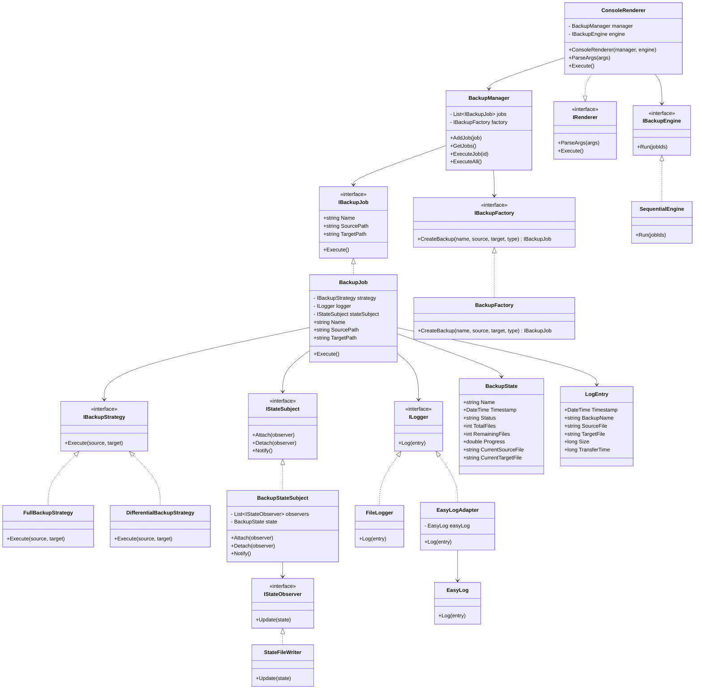

```mermaid
classDiagram
%% ==============================
%% INTERFACES
%% ==============================
 
class IBackupJob {
<<interface>>
+string Name
+string SourcePath
+string TargetPath
+Execute()
}
 
class IBackupStrategy {
<<interface>>
+Execute(source, target)
}
 
class ILogger {
<<interface>>
+Log(entry)
}
 
class IStateObserver {
<<interface>>
+Update(state)
}
 
class IStateSubject {
<<interface>>
+Attach(observer)
+Detach(observer)
+Notify()
}
 
class IBackupEngine {
<<interface>>
+Run(jobIds)
}
 
class IBackupFactory {
<<interface>>
+CreateBackup(name, source, target, type) IBackupJob
}
 
class IRenderer {
<<interface>>
+ParseArgs(args)
+Execute()
}
 
%% ==============================
%% CORE
%% ==============================
 
class BackupJob {
- IBackupStrategy strategy
- ILogger logger
- IStateSubject stateSubject
+string Name
+string SourcePath
+string TargetPath
+Execute()
}
 
IBackupJob <|.. BackupJob
 
%% ==============================
%% STRATEGY
%% ==============================
 
class FullBackupStrategy {
+Execute(source, target)
}
 
class DifferentialBackupStrategy {
+Execute(source, target)
}
 
IBackupStrategy <|.. FullBackupStrategy
IBackupStrategy <|.. DifferentialBackupStrategy
 
BackupJob --> IBackupStrategy
 
%% ==============================
%% FACTORY
%% ==============================
 
class BackupFactory {
+CreateBackup(name, source, target, type) IBackupJob
}
 
IBackupFactory <|.. BackupFactory
 
%% ==============================
%% MANAGER
%% ==============================
 
class BackupManager {
- List~IBackupJob~ jobs
- IBackupFactory factory
+AddJob(job)
+GetJobs()
+ExecuteJob(id)
+ExecuteAll()
}
 
BackupManager --> IBackupJob
BackupManager --> IBackupFactory
 
%% ==============================
%% OBSERVER
%% ==============================
 
class BackupState {
+string Name
+DateTime Timestamp
+string Status
+int TotalFiles
+int RemainingFiles
+double Progress
+string CurrentSourceFile
+string CurrentTargetFile
}
 
class BackupStateSubject {
- List~IStateObserver~ observers
- BackupState state
+Attach(observer)
+Detach(observer)
+Notify()
}
 
class StateFileWriter {
+Update(state)
}
 
IStateSubject <|.. BackupStateSubject
IStateObserver <|.. StateFileWriter
 
BackupJob --> IStateSubject
BackupStateSubject --> IStateObserver
 
%% ==============================
%% LOGGING
%% ==============================
 
class EasyLog {
+Log(entry)
}
 
class FileLogger {
+Log(entry)
}
 
class EasyLogAdapter {
- EasyLog easyLog
+Log(entry)
}
 
ILogger <|.. FileLogger
ILogger <|.. EasyLogAdapter
EasyLogAdapter --> EasyLog
 
BackupJob --> ILogger
 
%% ==============================
%% LOG MODEL
%% ==============================
 
class LogEntry {
+DateTime Timestamp
+string BackupName
+string SourceFile
+string TargetFile
+long Size
+long TransferTime
}
 
BackupJob --> LogEntry
BackupJob --> BackupState
 
%% ==============================
%% ENGINE
%% ==============================
 
class SequentialEngine {
+Run(jobIds)
}
 
IBackupEngine <|.. SequentialEngine
 
%% ==============================
%% RENDERER LAYER
%% ==============================
 
class ConsoleRenderer {
- BackupManager manager
- IBackupEngine engine
+ConsoleRenderer(manager, engine)
+ParseArgs(args)
+Execute()
}
 
ConsoleRenderer ..|> IRenderer
ConsoleRenderer --> BackupManager
ConsoleRenderer --> IBackupEngine

```