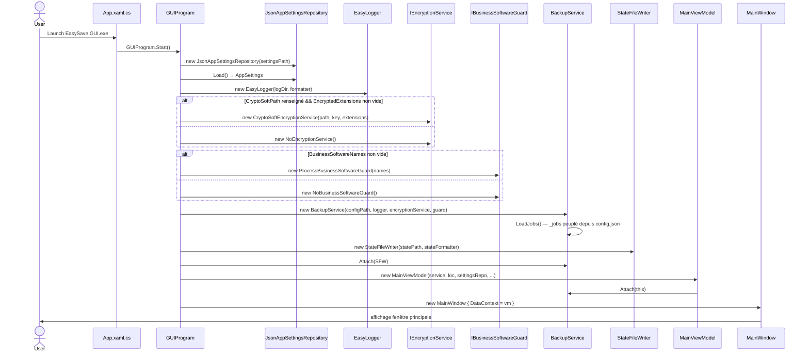
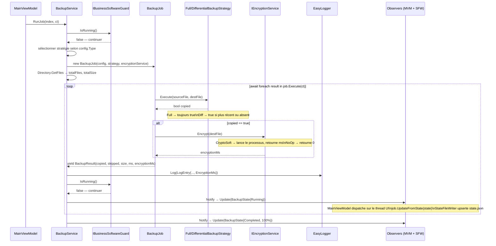
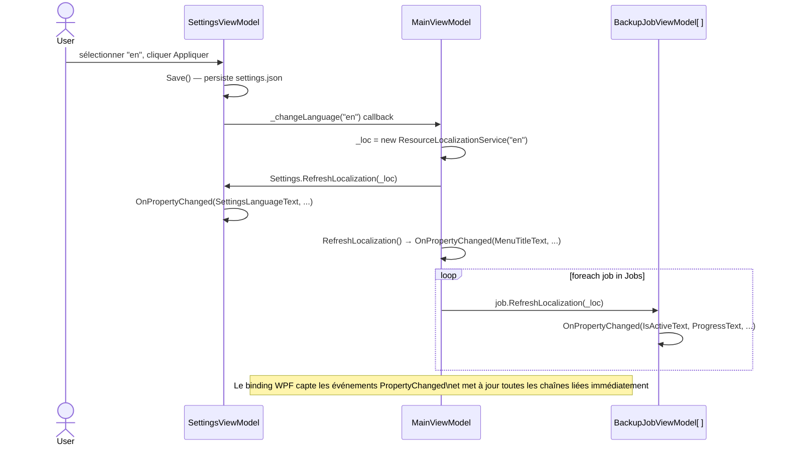
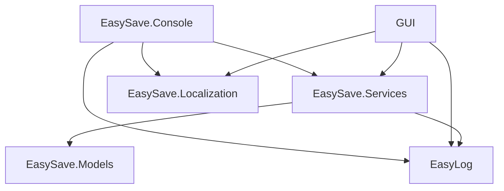

# EasySave v2.0 — Design Document

> Livrable 2 — Interface graphique (WPF MVVM), chiffrement fichier par fichier (CryptoSoft),
> garde logiciel métier, sélection du format de log JSON/XML et changement de langue en temps réel.
> Rétro-compatible avec le mode console v1 ; conçu pour absorber v3 (exécution parallèle).

---

## Table des matières

1. [Diagramme de classes](#1-diagramme-de-classes)
2. [Diagrammes de séquence](#2-diagrammes-de-séquence)
3. [Choix de conception](#3-choix-de-conception)
4. [Règle d'or des dépendances](#4-règle-dor-des-dépendances)
5. [Tableau récapitulatif des décisions](#5-tableau-récapitulatif-des-décisions)

---

## 1. Diagramme de classes

```mermaid
classDiagram

    %% ─────────────────────────────────────────
    %% PACKAGE: EasyLog.dll
    %% ─────────────────────────────────────────
    namespace EasyLog {
        class LogEntry {
            +DateTime Timestamp
            +string BackupName
            +string SourcePath
            +string DestPath
            +long FileSize
            +long TransferMs
            +long EncryptionMs
        }
        class ILogFormatter {
            <<interface>>
            +string FileExtension
            +Format(List~LogEntry~) string
            +Read(string) List~LogEntry~
        }
        class JsonLogFormatter {
            +string FileExtension
            +Format(List~LogEntry~) string
            +Read(string) List~LogEntry~
        }
        class XmlLogFormatter {
            +string FileExtension
            +Format(List~LogEntry~) string
            +Read(string) List~LogEntry~
        }
        class EasyLogger {
            -string _logDirectory
            -ILogFormatter _formatter
            -object _lock
            +Log(LogEntry) void
        }
    }
    JsonLogFormatter ..|> ILogFormatter : implements
    XmlLogFormatter ..|> ILogFormatter : implements
    EasyLogger --> ILogFormatter : uses
    EasyLogger --> LogEntry : uses

    %% ─────────────────────────────────────────
    %% PACKAGE: EasySave.Models
    %% ─────────────────────────────────────────
    namespace EasySave_Models {
        class BackupType {
            <<enumeration>>
            Full
            Differential
        }
        class BackupStatus {
            <<enumeration>>
            Idle
            Running
            Paused
            Completed
            Interrupted
            Error
        }
        class LogFormat {
            <<enumeration>>
            Json
            Xml
        }
        class BackupJobConfig {
            +string Name
            +string SourceDir
            +string TargetDir
            +BackupType Type
            +bool IsActive
        }
        class BackupState {
            +string Name
            +DateTime LastActionTime
            +BackupStatus Status
            +int TotalFiles
            +long TotalSize
            +int RemainingFiles
            +long RemainingSize
            +float Progress
            +string CurrentSource
            +string CurrentDest
            +bool LastFileSkipped
        }
        class AppSettings {
            +LogFormat LogFormat
            +string Language
            +string CryptoSoftPath
            +string EncryptionKey
            +List~string~ EncryptedExtensions
            +List~string~ BusinessSoftwareNames
        }
        class IStateObserver {
            <<interface>>
            +Update(BackupState) void
        }
    }
    BackupJobConfig --> BackupType
    BackupState --> BackupStatus
    AppSettings --> LogFormat

    %% ─────────────────────────────────────────
    %% PACKAGE: EasySave.Services
    %% ─────────────────────────────────────────
    namespace EasySave_Services {
        class IStateSubject {
            <<interface>>
            +Attach(IStateObserver) void
            +Detach(IStateObserver) void
            +Notify(BackupState) void
        }
        class IBackupStrategy {
            <<interface>>
            +Execute(string, string) bool
        }
        class IBackupJobRepository {
            <<interface>>
            +GetAll() IEnumerable~BackupJobConfig~
            +Save(IEnumerable~BackupJobConfig~) void
        }
        class IEncryptionService {
            <<interface>>
            +Encrypt(string) long
            +ShouldEncrypt(string) bool
        }
        class IBusinessSoftwareGuard {
            <<interface>>
            +IsRunning() bool
        }
        class IStateFormatter {
            <<interface>>
            +string FileExtension
            +Format(List~BackupState~) string
            +Read(string) List~BackupState~
        }
        class BackupResult {
            <<record>>
            +string SourcePath
            +string DestPath
            +long FileSize
            +long TransferMs
            +bool Success
            +bool Skipped
            +long EncryptionMs
        }
        class BackupJob {
            -BackupJobConfig _config
            -IBackupStrategy _strategy
            -IEncryptionService _encryptionService
            +Execute(CancellationToken) IAsyncEnumerable~BackupResult~
        }
        class BackupService {
            <<Facade>>
            -List~IStateObserver~ _observers
            -IBackupJobRepository _repository
            -EasyLogger _logger
            -IEncryptionService _encryptionService
            -IBusinessSoftwareGuard _guard
            -List~BackupJobConfig~ _jobs
            +Attach(IStateObserver) void
            +Detach(IStateObserver) void
            +Notify(BackupState) void
            +AddJob(BackupJobConfig) void
            +RemoveJob(int) void
            +UpdateJob(int, BackupJobConfig) void
            +GetJobs() IEnumerable~BackupJobConfig~
            +RunJob(int, CancellationToken) Task
            +RunRange(IEnumerable~int~, CancellationToken) Task
        }
        class StateFileWriter {
            -string _statePath
            -IStateFormatter _formatter
            -object _lock
            +Update(BackupState) void
        }
        class FullBackupStrategy {
            +Execute(string, string) bool
        }
        class DifferentialBackupStrategy {
            +Execute(string, string) bool
        }
        class JsonBackupJobRepository {
            -string _configPath
            +GetAll() IEnumerable~BackupJobConfig~
            +Save(IEnumerable~BackupJobConfig~) void
        }
        class JsonStateFormatter {
            +string FileExtension
            +Format(List~BackupState~) string
            +Read(string) List~BackupState~
        }
        class XmlStateFormatter {
            +string FileExtension
            +Format(List~BackupState~) string
            +Read(string) List~BackupState~
        }
        class CryptoSoftEncryptionService {
            -string _cryptoSoftPath
            -string _encryptionKey
            -IReadOnlySet~string~ _encryptedExtensions
            +ShouldEncrypt(string) bool
            +Encrypt(string) long
        }
        class NoEncryptionService {
            +ShouldEncrypt(string) bool
            +Encrypt(string) long
        }
        class NoBusinessSoftwareGuard {
            +IsRunning() bool
        }
        class ProcessBusinessSoftwareGuard {
            -IReadOnlyList~string~ _processNames
            +IsRunning() bool
        }
    }

    StateFileWriter ..|> IStateObserver : implements
    FullBackupStrategy ..|> IBackupStrategy : implements
    DifferentialBackupStrategy ..|> IBackupStrategy : implements
    JsonBackupJobRepository ..|> IBackupJobRepository : implements
    JsonStateFormatter ..|> IStateFormatter : implements
    XmlStateFormatter ..|> IStateFormatter : implements
    CryptoSoftEncryptionService ..|> IEncryptionService : implements
    NoEncryptionService ..|> IEncryptionService : implements
    NoBusinessSoftwareGuard ..|> IBusinessSoftwareGuard : implements
    ProcessBusinessSoftwareGuard ..|> IBusinessSoftwareGuard : implements
    BackupService ..|> IStateSubject : implements
    BackupService --> IBackupJobRepository : uses
    BackupService --> IEncryptionService : uses
    BackupService --> IBusinessSoftwareGuard : uses
    BackupService --> EasyLogger : uses
    BackupService --> BackupJob : creates
    BackupService --> IStateObserver : notifies
    BackupJob --> IBackupStrategy : uses
    BackupJob --> IEncryptionService : uses
    BackupJob --> BackupResult : yields
    StateFileWriter --> IStateFormatter : uses

    %% ─────────────────────────────────────────
    %% PACKAGE: EasySave.Localization
    %% ─────────────────────────────────────────
    namespace EasySave_Localization {
        class ILocalizationService {
            <<interface>>
            +Get(string) string
        }
        class ResourceLocalizationService {
            -ResourceManager _resourceManager
            -CultureInfo _culture
            +Get(string) string
        }
    }
    ResourceLocalizationService ..|> ILocalizationService : implements

    %% ─────────────────────────────────────────
    %% PACKAGE: EasySave.Console
    %% ─────────────────────────────────────────
    namespace EasySave_Console {
        class ConsoleObserver {
            -ILocalizationService _loc
            +Update(BackupState) void
        }
        class CommandLineParser {
            +Parse(string[]) IEnumerable~int~
        }
        class CommandLineRunner {
            -BackupService _service
            -CommandLineParser _parser
            +Run(string[]) Task
        }
        class InteractiveShell {
            -BackupService _service
            -ILocalizationService _loc
            -AppSettings _appSettings
            -string _settingsPath
            +Run() Task
        }
    }

    ConsoleObserver ..|> IStateObserver : implements
    ConsoleObserver --> ILocalizationService
    CommandLineRunner --> BackupService : uses
    CommandLineRunner --> CommandLineParser : uses
    InteractiveShell --> BackupService : uses
    InteractiveShell --> ILocalizationService

    %% ─────────────────────────────────────────
    %% PACKAGE: GUI
    %% ─────────────────────────────────────────
    namespace EasySave_GUI {
        class GUIProgram {
            +Start()$ void
        }
        class ViewModelBase {
            <<abstract>>
            #SetProperty~T~(T, T, string) bool
            #OnPropertyChanged(string) void
        }
        class MainViewModel {
            -BackupService _service
            -ILocalizationService _loc
            -IAppSettingsRepository _settingsRepo
            +ObservableCollection~BackupJobViewModel~ Jobs
            +BackupJobViewModel SelectedJob
            +SettingsViewModel Settings
            +ICommand AddJobCommand
            +ICommand RemoveJobCommand
            +ICommand RunSelectedCommand
            +ICommand RunAllCommand
            +string StatusMessage
            +Update(BackupState) void
        }
        class BackupJobViewModel {
            -BackupJobConfig _config
            -ILocalizationService _loc
            +string Name
            +string SourceDir
            +string TargetDir
            +BackupType Type
            +float Progress
            +BackupStatus Status
            +UpdateFromConfig(BackupJobConfig) void
            +UpdateFromState(BackupState) void
            +RefreshLocalization(ILocalizationService) void
        }
        class SettingsViewModel {
            -IAppSettingsRepository _repo
            -ILocalizationService _loc
            +LogFormat LogFormat
            +string SelectedLanguage
            +ObservableCollection~string~ BusinessSoftwareNames
            +ObservableCollection~string~ EncryptedExtensions
            +string StatusMessage
            +ICommand SaveCommand
            +RefreshLocalization(ILocalizationService) void
        }
        class RelayCommand {
            -Action _execute
            -Func~bool~ _canExecute
            +CanExecute(object) bool
            +Execute(object) void
            +RaiseCanExecuteChanged() void
        }
        class IAppSettingsRepository {
            <<interface>>
            +Load() AppSettings
            +Save(AppSettings) void
        }
        class JsonAppSettingsRepository {
            -string _settingsPath
            +Load() AppSettings
            +Save(AppSettings) void
        }
    }

    MainViewModel --|> ViewModelBase : inherits
    BackupJobViewModel --|> ViewModelBase : inherits
    SettingsViewModel --|> ViewModelBase : inherits
    MainViewModel ..|> IStateObserver : implements
    RelayCommand ..|> ICommand : implements
    JsonAppSettingsRepository ..|> IAppSettingsRepository : implements
    GUIProgram --> BackupService : creates
    GUIProgram --> MainViewModel : creates
    GUIProgram --> JsonAppSettingsRepository : creates
    MainViewModel --> BackupService : uses
    MainViewModel --> ILocalizationService : uses
    MainViewModel --> IAppSettingsRepository : uses
    MainViewModel o-- SettingsViewModel : has
    MainViewModel o-- BackupJobViewModel : has
    BackupJobViewModel --> ILocalizationService : uses
    SettingsViewModel --> IAppSettingsRepository : uses
    SettingsViewModel --> ILocalizationService : uses
```



---

## 2. Diagrammes de séquence

### 2.1 Démarrage et injection (GUI v2 — GUIProgram)



### 2.2 Exécution d'un job (RunJob — v2 avec chiffrement)



### 2.3 Changement de langue en temps réel



---

## 3. Choix de conception

### 3.1 Facade — `BackupService`

**Décision** : `BackupService` est le point d'entrée unique pour la couche console et pour la GUI.

**Justification** : toute la coordination (chargement des jobs, exécution, logging, notification d'état) transite par un seul point de contrôle. La console et la GUI n'ont jamais à connaître les classes internes. En v2, la GUI se branche sur `BackupService` sans modifier quoi que ce soit dans la couche Services.

---

### 3.2 Observer — `IStateSubject` / `IStateObserver`

**Décision** : `BackupService` implémente `IStateSubject` et notifie les observers enregistrés (`ConsoleObserver`, `StateFileWriter`, `MainViewModel`). Les observers sont injectés par `Program` (console) ou `GUIProgram` (GUI) via `Attach()`.

**Justification** : l'affichage en temps réel (fichier par fichier) est requis depuis v1 et doit fonctionner en mode parallèle v3. Le pattern Observer découple la source d'événements (la sauvegarde) de ses consommateurs (terminal, fichier, fenêtre WPF, futur réseau). La console et la GUI n'interagissent qu'avec la Facade — elles ne touchent jamais `IStateSubject` directement.

**Point clé** : `BackupJob` ne notifie pas lui-même les observers. Il retourne un `BackupResult` à la Facade, qui centralise la notification. Cela prévient les appels concurrents non coordonnés aux observers en v3.

---

### 3.3 Strategy — `IBackupStrategy`

**Décision** : `FullBackupStrategy` et `DifferentialBackupStrategy` implémentent `IBackupStrategy`. La stratégie est injectée dans `BackupJob` à la construction. `Execute()` retourne un `bool` indiquant si le fichier a effectivement été copié (`true`) ou ignoré (`false`).

**Justification** : le type de sauvegarde est une dimension variable indépendante du reste de l'orchestration. Le retour `bool` permet à `BackupJob` de propager l'information copié/ignoré vers le haut via `BackupResult.Skipped`, sans couplage entre la stratégie et la couche observer.

---

### 3.4 Repository — `IBackupJobRepository`

**Décision** : `JsonBackupJobRepository` implémente `IBackupJobRepository` et est instancié en interne par `BackupService` via un `string configPath`.

**Justification** : la persistance est abstraite derrière une interface. En v2, basculer vers une base de données ou un autre format ne nécessite aucune modification de `BackupService`. `BackupJob` n'a aucune raison de savoir d'où vient sa configuration — il reçoit un `BackupJobConfig` déjà construit.

---

### 3.5 `BackupJob` — unité parallélisable

**Décision** : `BackupJob` ne tient que `BackupJobConfig`, `IBackupStrategy` et `IEncryptionService`. `Execute()` prend un `CancellationToken` et yield `BackupResult` via `IAsyncEnumerable`.

**Justification** : pour la parallélisation v3, chaque `BackupJob` doit être une unité de travail isolée et sans état partagé. Retirer `EasyLogger` et `IStateSubject` de `BackupJob` élimine les deux principales sources de race conditions. `IEncryptionService` est sans état (lecture de config uniquement) — son utilisation dans `BackupJob` est thread-safe. Le `CancellationToken` permet d'annuler un job individuel sans arrêter les autres.

---

### 3.6 `LogEntry` — placement dans `EasyLog.dll`

**Décision** : `LogEntry` reste dans `EasyLog.dll`. Le champ `EncryptionMs` y a été ajouté en v2.

**Justification** : `EasyLog.dll` est conçu comme une dll autonome sans dépendance externe, réutilisable dans d'autres projets. Déplacer `LogEntry` dans `EasySave.Models` couplerait la dll à ce projet. L'ajout de `EncryptionMs` est une extension du contrat de log, cohérente avec la responsabilité de la dll.

---

### 3.7 `IEncryptionService` / `IBusinessSoftwareGuard` — Strategy + Null Object

**Décision** : chaque service a deux implémentations — une réelle (`CryptoSoftEncryptionService`, `ProcessBusinessSoftwareGuard`) et un no-op (`NoEncryptionService`, `NoBusinessSoftwareGuard`). Le choix est fait au démarrage en lisant `AppSettings`.

**Justification** : le pattern Null Object évite les tests conditionnels dans le pipeline d'exécution. `BackupJob.Execute()` appelle toujours `_encryptionService.Encrypt()` — il ne vérifie pas si le chiffrement est activé. `BackupService.RunJob()` appelle toujours `_guard.IsRunning()` — il ne vérifie pas si une garde est configurée. Le cœur d'exécution reste propre, et ajouter un nouveau service de chiffrement (ou un autre détecteur de processus) est une affaire d'implémenter l'interface, pas de modifier la Facade.

---

### 3.8 Localisation en temps réel

**Décision** : `ILocalizationService` est injecté dans tous les ViewModels (`MainViewModel`, `BackupJobViewModel`, `SettingsViewModel`) à la construction. Lors du changement de langue, `MainViewModel.ChangeLanguage()` remplace son instance `_loc` et propage le nouvel `ILocalizationService` à `SettingsViewModel` et à chaque `BackupJobViewModel` via `RefreshLocalization()`.

**Justification** : résoudre la localisation de façon statique (singleton global) obligerait à redémarrer l'application pour appliquer un changement de langue. L'injection de `ILocalizationService` et sa propagation explicite permettent un rafraîchissement instantané de l'UI sans redémarrage. Le binding WPF capte les événements `PropertyChanged` automatiquement et met à jour toutes les chaînes liées en un cycle.

---

## 4. Règle d'or des dépendances



```
EasySave.Console
    ├── EasySave.Services
    │       ├── EasySave.Models
    │       └── EasyLog
    ├── EasySave.Localization
    └── EasyLog

GUI (EasySave.GUI)
    ├── EasySave.Services
    │       ├── EasySave.Models
    │       └── EasyLog
    ├── EasySave.Localization
    └── EasyLog

EasySave.Models       ──► aucune dépendance interne
EasyLog               ──► aucune dépendance interne
EasySave.Localization ──► aucune dépendance interne
```

> **Ancrage des chemins** : `config.json`, `state.json` et `logs/` sont résolus relativement à la racine de la solution via `AppContext.BaseDirectory + ../../../../`. Cette logique est dupliquée dans `Program` (console) et `GUIProgram` (GUI) pour garantir des chemins stables quel que soit le mode de lancement.

---

## 5. Tableau récapitulatif des décisions

| # | Élément | Décision | Impact v3 (parallèle) |
|---|---|---|---|
| 1 | `BackupService` | Facade — point d'entrée unique | Inchangé |
| 2 | `ConsoleObserver` / `StateFileWriter` / `MainViewModel` | Injectés via `Attach()` sur la Facade | Inchangé |
| 3 | `EasyLogger` | Sur la Facade, pas sur `BackupJob` | Prévient les race conditions d'écriture |
| 4 | `IStateSubject` | Sur la Facade, pas sur `BackupJob` | Prévient les notifications concurrentes |
| 5 | `CancellationToken` | Passé à `BackupJob.Execute()` | Annulation individuelle par job |
| 6 | `IBackupStrategy.Execute()` | Retourne `bool` (copié / ignoré) | Chaque job parallèle porte sa propre stratégie |
| 7 | `IBackupJobRepository` | Instancié en interne par `BackupService` | `BackupJob` reçoit un config déjà construit |
| 8 | `LogEntry` | Dans `EasyLog.dll` (+ `EncryptionMs` en v2) | `EasyLog.dll` reste autonome et réutilisable |
| 9 | Ancrage des chemins | Relatif à la racine solution via `AppContext.BaseDirectory` | Chemins stables dans tous les modes de lancement |
| 10 | `IEncryptionService` | Null Object — `NoEncryptionService` si non configuré | `BackupJob` n'a aucun conditionnel lié au chiffrement |
| 11 | `IBusinessSoftwareGuard` | Null Object — `NoBusinessSoftwareGuard` si non configuré | Vérification de la garde sans verrou en v3 (lecture seule) |
| 12 | `ILocalizationService` | Injecté dans les ViewModels, remplacé au changement de langue | Aucun impact (concerne uniquement la GUI) |
| 13 | `IAppSettingsRepository` | `JsonAppSettingsRepository` — persistance des paramètres GUI | Chargé au démarrage, non référencé dans Services |
| 14 | `IStateFormatter` | `JsonStateFormatter` / `XmlStateFormatter` — format du fichier d'état | `StateFileWriter` n'a pas à connaître le format |
