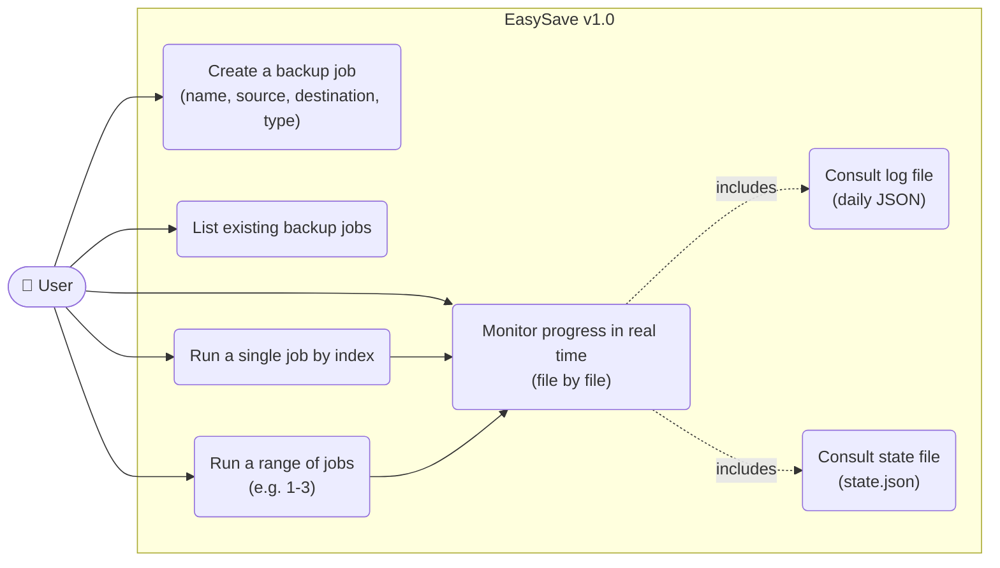
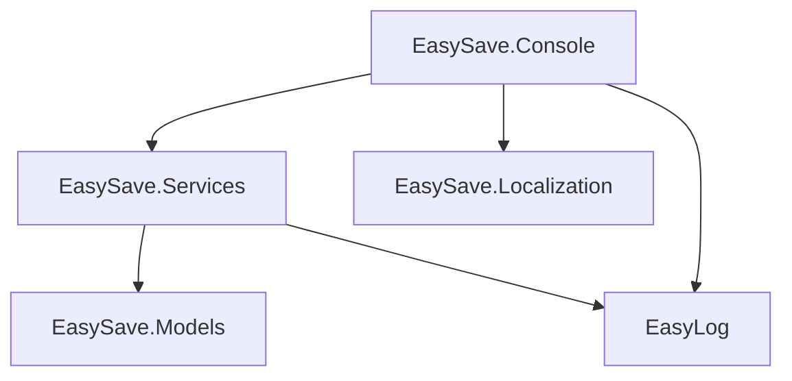
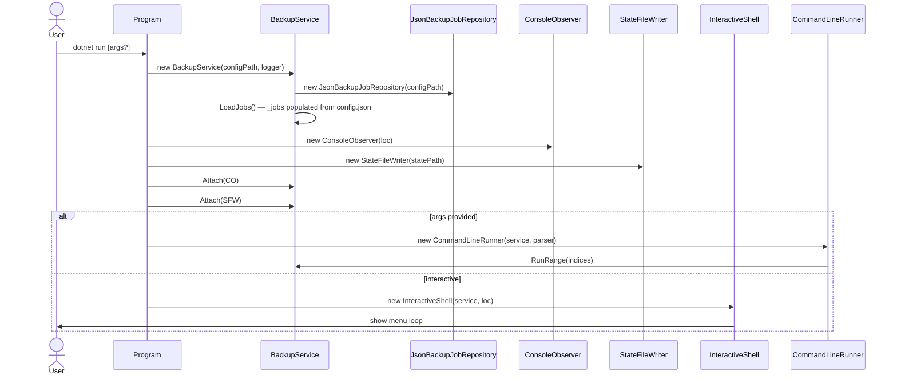
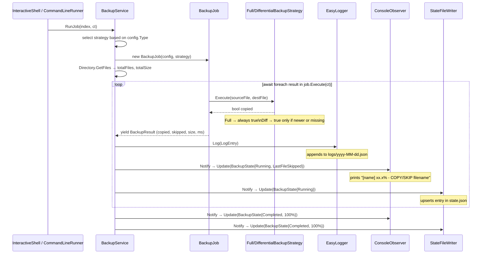

# EasySave v1.0 — Design Document

> Livrable 1 — Console application, sequential backups only.
> Designed to absorb v2 (GUI) and v3 (parallel) without rewriting existing code.

---

## Table of Contents

1. [Use Case Diagram](#1-use-case-diagram)
2. [Assembly Dependency Graph](#2-assembly-dependency-graph)
3. [Class Diagram](#3-class-diagram)
4. [Sequence Diagrams](#4-sequence-diagrams)
5. [Design Decisions](#5-design-decisions)

---

## 1. Use Case Diagram



---

## 2. Assembly Dependency Graph



```
EasySave.Console
    ├── EasySave.Services
    │       ├── EasySave.Models
    │       └── EasyLog
    ├── EasySave.Localization
    └── EasyLog

EasySave.Models  ──► no internal dependencies
EasyLog          ──► no internal dependencies
```

---

## 3. Class Diagram

```mermaid
classDiagram

    %% ─────────────────────────────────────────
    %% PACKAGE: EasyLog
    %% ─────────────────────────────────────────
    namespace EasyLog {
        class LogEntry {
            +DateTime Timestamp
            +string BackupName
            +string SourcePath
            +string DestPath
            +long FileSize
            +long TransferMs
        }
        class EasyLogger {
            -string _logDirectory
            -object _lock
            +Log(LogEntry) void
        }
    }
    EasyLogger --> LogEntry : uses

    %% ─────────────────────────────────────────
    %% PACKAGE: EasySave.Models
    %% ─────────────────────────────────────────
    namespace EasySave_Models {
        class BackupType {
            <<enumeration>>
            Full
            Differential
        }
        class BackupStatus {
            <<enumeration>>
            Idle
            Running
            Paused
            Completed
            Error
        }
        class BackupJobConfig {
            +string Name
            +string SourceDir
            +string TargetDir
            +BackupType Type
            +bool IsActive
        }
        class BackupState {
            +string Name
            +DateTime LastActionTime
            +BackupStatus Status
            +int TotalFiles
            +long TotalSize
            +int RemainingFiles
            +long RemainingSize
            +float Progress
            +string CurrentSource
            +string CurrentDest
            +bool LastFileSkipped
        }
        class IStateObserver {
            <<interface>>
            +Update(BackupState) void
        }
    }
    BackupJobConfig --> BackupType
    BackupState --> BackupStatus

    %% ─────────────────────────────────────────
    %% PACKAGE: EasySave.Services
    %% ─────────────────────────────────────────
    namespace EasySave_Services {
        class IStateSubject {
            <<interface>>
            +Attach(IStateObserver) void
            +Detach(IStateObserver) void
            +Notify(BackupState) void
        }
        class IBackupStrategy {
            <<interface>>
            +Execute(string, string) bool
        }
        class IBackupJobRepository {
            <<interface>>
            +GetAll() IEnumerable~BackupJobConfig~
            +Save(IEnumerable~BackupJobConfig~) void
        }
        class BackupResult {
            <<record>>
            +string SourcePath
            +string DestPath
            +long FileSize
            +long TransferMs
            +bool Success
            +bool Skipped
        }
        class BackupJob {
            -BackupJobConfig _config
            -IBackupStrategy _strategy
            +Execute(CancellationToken) IAsyncEnumerable~BackupResult~
        }
        class BackupService {
            <<Facade>>
            -List~IStateObserver~ _observers
            -IBackupJobRepository _repository
            -EasyLogger _logger
            -List~BackupJobConfig~ _jobs
            +Attach(IStateObserver) void
            +Detach(IStateObserver) void
            +Notify(BackupState) void
            +LoadJobs() void
            +AddJob(BackupJobConfig) void
            +RemoveJob(int) void
            +UpdateJob(int, BackupJobConfig) void
            +GetJobs() IEnumerable~BackupJobConfig~
            +RunJob(int, CancellationToken) Task
            +RunRange(IEnumerable~int~, CancellationToken) Task
        }
        class StateFileWriter {
            -string _statePath
            -object _lock
            +Update(BackupState) void
        }
        class FullBackupStrategy {
            +Execute(string, string) bool
        }
        class DifferentialBackupStrategy {
            +Execute(string, string) bool
        }
        class JsonBackupJobRepository {
            -string _configPath
            +GetAll() IEnumerable~BackupJobConfig~
            +Save(IEnumerable~BackupJobConfig~) void
        }
    }

    StateFileWriter ..|> IStateObserver : implements
    FullBackupStrategy ..|> IBackupStrategy : implements
    DifferentialBackupStrategy ..|> IBackupStrategy : implements
    JsonBackupJobRepository ..|> IBackupJobRepository : implements
    BackupService ..|> IStateSubject : implements
    BackupService --> BackupJob : creates
    BackupService --> EasyLogger : uses
    BackupService --> IStateObserver : notifies
    BackupJob --> IBackupStrategy : uses
    BackupJob --> BackupResult : yields

    %% ─────────────────────────────────────────
    %% PACKAGE: EasySave.Localization
    %% ─────────────────────────────────────────
    namespace EasySave_Localization {
        class ILocalizationService {
            <<interface>>
            +Get(string) string
        }
        class ResourceLocalizationService {
            -ResourceManager _resourceManager
            -CultureInfo _culture
            +Get(string) string
        }
    }
    ResourceLocalizationService ..|> ILocalizationService : implements

    %% ─────────────────────────────────────────
    %% PACKAGE: EasySave.Console
    %% ─────────────────────────────────────────
    namespace EasySave_Console {
        class ConsoleObserver {
            -ILocalizationService _loc
            +Update(BackupState) void
        }
        class CommandLineParser {
            +Parse(string[]) IEnumerable~int~
        }
        class CommandLineRunner {
            -BackupService _service
            -CommandLineParser _parser
            +Run(string[]) Task
        }
        class InteractiveShell {
            -BackupService _service
            -ILocalizationService _loc
            +Run() Task
        }
    }

    ConsoleObserver ..|> IStateObserver : implements
    ConsoleObserver --> ILocalizationService
    CommandLineRunner --> BackupService : uses
    CommandLineRunner --> CommandLineParser : uses
    InteractiveShell --> BackupService : uses
    InteractiveShell --> ILocalizationService
```



---

## 4. Sequence Diagrams

### 4.1 Startup and observer injection



### 4.2 Job execution (RunJob — sequential v1)



---

## 5. Design Decisions

### 5.1 Facade — `BackupService`

**Decision**: `BackupService` is the single entry point for both the console layer and, in the future, the GUI.

**Rationale**: all coordination (job loading, execution, logging, state notification) flows through one control point. The console and GUI never need to know about internal classes. In v2, a GUI plugs into `BackupService` without modifying anything in the Services layer.

---

### 5.2 Observer — `IStateSubject` / `IStateObserver`

**Decision**: `BackupService` implements `IStateSubject` and notifies registered observers (`ConsoleObserver`, `StateFileWriter`). Observers are injected by `Program` via `Attach()`.

**Rationale**: real-time display (file by file) is required from v1 and must work in v3 parallel mode. The Observer pattern decouples the event source (the backup) from its consumers (terminal, file, future network). The console only interacts with the Facade — it never touches `IStateSubject` directly.

**Key point**: `BackupJob` does not notify observers itself. It returns a `BackupResult` to the Facade, which centralizes notification. This prevents uncoordinated concurrent calls to observers in v3.

---

### 5.3 Strategy — `IBackupStrategy`

**Decision**: `FullBackupStrategy` and `DifferentialBackupStrategy` implement `IBackupStrategy`. The strategy is injected into `BackupJob` at construction time. `Execute()` returns a `bool` indicating whether the file was actually copied (`true`) or skipped (`false`).

**Rationale**: the backup type is a variable dimension independent of the rest of the orchestration. The `bool` return allows `BackupJob` to propagate skip/copy information upstream via `BackupResult.Skipped`, without any coupling between the strategy and the observer layer.

---

### 5.4 Repository — `IBackupJobRepository`

**Decision**: `JsonBackupJobRepository` implements `IBackupJobRepository` and is instantiated internally by `BackupService` via a `string configPath`.

**Rationale**: persistence is abstracted behind an interface. In v2, switching to a database or another format requires no changes to `BackupService`. `BackupJob` has no reason to know where its configuration comes from — it receives a fully built `BackupJobConfig`.

---

### 5.5 `BackupJob` — parallelizable unit

**Decision**: `BackupJob` only holds `BackupJobConfig` and `IBackupStrategy`. `Execute()` takes a `CancellationToken` and yields `BackupResult` via `IAsyncEnumerable`.

**Rationale**: for v3 parallelization, each `BackupJob` must be an isolated, stateless unit of work. Removing `EasyLogger` and `IStateSubject` from `BackupJob` eliminates the two main sources of race conditions. The `CancellationToken` allows cancelling an individual job without stopping the others.

---

### 5.6 `LogEntry` — placement in `EasyLog.dll`

**Decision**: `LogEntry` stays inside `EasyLog.dll`.

**Rationale**: `EasyLog.dll` is designed to be a fully autonomous dll with no external dependencies, reusable across other projects. Moving `LogEntry` to `EasySave.Models` would couple the dll to this project.

---

### 5.7 Path anchoring — solution root

**Decision**: `config.json`, `state.json`, and `logs/` are resolved relative to the solution root using `AppContext.BaseDirectory` + `../../../../`.

**Rationale**: `dotnet run` sets the working directory to the project folder, not the solution root. Anchoring to `BaseDirectory` ensures paths are stable regardless of how the app is launched.

---

## Decision Summary

| # | Element | Decision | Impact on v3 (parallel) |
|---|---|---|---|
| 1 | `BackupService` | Facade — single entry point | Unchanged |
| 2 | `ConsoleObserver` / `StateFileWriter` | Injected via `Attach()` on the Facade | Unchanged |
| 3 | `EasyLogger` | On the Facade, not on `BackupJob` | Prevents write race conditions |
| 4 | `IStateSubject` | On the Facade, not on `BackupJob` | Prevents concurrent notifications |
| 5 | `CancellationToken` | Passed to `BackupJob.Execute()` | Individual job cancellation |
| 6 | `IBackupStrategy.Execute()` | Returns `bool` (copied / skipped) | Each parallel job carries its own strategy |
| 7 | `IBackupJobRepository` | Instantiated internally by `BackupService` | `BackupJob` receives a pre-built config |
| 8 | `LogEntry` | Inside `EasyLog.dll` | `EasyLog.dll` remains autonomous and reusable |
| 9 | Path anchoring | Relative to solution root via `AppContext.BaseDirectory` | Consistent paths across all run modes |
