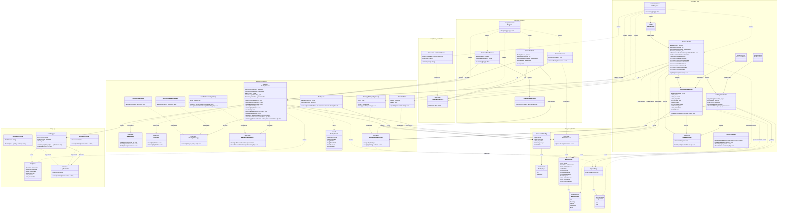

```mermaid
classDiagram
    namespace EasyLog {
        class LogEntry {
            +DateTime Timestamp
            +string BackupName
            +string SourcePath
            +string DestPath
            +long FileSize
            +long TransferMs
        }
        class ILogFormatter {
            <<interface>>
            +FileExtension string
            +Format(List~LogEntry~ entries) string
        }
        class JsonLogFormatter {
            +FileExtension string
            +Format(List~LogEntry~ entries) string
        }
        class XmlLogFormatter {
            +FileExtension string
            +Format(List~LogEntry~ entries) string
        }
        class EasyLogger {
            -string _logDirectory
            -ILogFormatter _formatter
            -object _lock
            +EasyLogger(string logDir, ILogFormatter fmt)
            +Log(LogEntry entry) void
        }
    }
    JsonLogFormatter ..|> ILogFormatter : implements
    XmlLogFormatter ..|> ILogFormatter : implements
    EasyLogger --> ILogFormatter : _formatter
    EasyLogger ..> LogEntry : uses

    namespace EasySave_Models {
        class BackupType {
            <<enumeration>>
            Full
            Differential
        }
        class BackupStatus {
            <<enumeration>>
            Idle
            Running
            Paused
            Completed
            Error
        }
        class LogFormat {
            <<enumeration>>
            Json
            Xml
        }
        class BackupJobConfig {
            +string Name
            +string SourceDir
            +string TargetDir
            +BackupType Type
            +bool IsActive
        }
        class BackupState {
            +string Name
            +DateTime LastActionTime
            +BackupStatus Status
            +int TotalFiles
            +long TotalSize
            +int RemainingFiles
            +long RemainingSize
            +float Progress
            +string CurrentSource
            +string CurrentDest
            +bool LastFileSkipped
        }
        class AppSettings {
            +LogFormat LogFormat
        }
        class IStateObserver {
            <<interface>>
            +Update(BackupState state) void
        }
    }
    BackupJobConfig --> BackupType : uses
    BackupState --> BackupStatus : uses
    AppSettings --> LogFormat : uses
    IStateObserver ..> BackupState : param

    namespace EasySave_Services {
        class IStateSubject {
            <<interface>>
            +Attach(IStateObserver o) void
            +Detach(IStateObserver o) void
            +Notify(BackupState state) void
        }
        class IPausable {
            <<interface>>
            +Pause(int jobIndex) void
            +Resume(int jobIndex) void
        }
        class IBackupStrategy {
            <<interface>>
            +Execute(string src, string dst) bool
        }
        class IBackupJobRepository {
            <<interface>>
            +GetAll() IEnumerable~BackupJobConfig~
            +Save(IEnumerable~BackupJobConfig~ jobs) void
        }
        class IAppSettingsRepository {
            <<interface>>
            +Load() AppSettings
            +Save(AppSettings settings) void
        }
        class BackupResult {
            <<record>>
            +string SourcePath
            +string DestPath
            +long FileSize
            +long TransferMs
            +bool Success
            +bool Skipped
        }
        class BackupJob {
            -BackupJobConfig _config
            -IBackupStrategy _strategy
            +Execute(CancellationToken ct) IAsyncEnumerable~BackupResult~
        }
        class BackupService {
            <<Facade>>
            -List~IStateObserver~ _observers
            -IBackupJobRepository _repository
            -EasyLogger _logger
            -List~BackupJobConfig~ _jobs
            -Dictionary~int,MRE~ _pauseHandles
            +Attach(IStateObserver o) void
            +Detach(IStateObserver o) void
            +Notify(BackupState state) void
            +Pause(int jobIndex) void
            +Resume(int jobIndex) void
            +LoadJobs() void
            +AddJob(BackupJobConfig config) void
            +RemoveJob(int index) void
            +GetJobs() IEnumerable~BackupJobConfig~
            +RunJob(int index, CancellationToken ct) Task
            +RunRange(IEnumerable~int~ indices, CancellationToken ct) Task
        }
        class StateFileWriter {
            -string _statePath
            -object _lock
            +Update(BackupState state) void
        }
        class FullBackupStrategy {
            +Execute(string src, string dst) bool
        }
        class DifferentialBackupStrategy {
            +Execute(string src, string dst) bool
        }
        class JsonBackupJobRepository {
            -string _configPath
            +GetAll() IEnumerable~BackupJobConfig~
            +Save(IEnumerable~BackupJobConfig~ jobs) void
        }
        class JsonAppSettingsRepository {
            -string _path
            +Load() AppSettings
            +Save(AppSettings settings) void
        }
    }
    BackupService ..|> IStateSubject : implements
    BackupService ..|> IPausable : implements
    StateFileWriter ..|> IStateObserver : implements
    FullBackupStrategy ..|> IBackupStrategy : implements
    DifferentialBackupStrategy ..|> IBackupStrategy : implements
    JsonBackupJobRepository ..|> IBackupJobRepository : implements
    JsonAppSettingsRepository ..|> IAppSettingsRepository : implements
    BackupService --> EasyLogger : _logger
    BackupService --> IBackupJobRepository : _repository
    BackupService --> IStateObserver : _observers 0..*
    BackupService --> BackupJobConfig : _jobs 0..*
    BackupService ..> BackupState : creates
    BackupService ..> LogEntry : creates
    BackupJob --> BackupJobConfig : _config
    BackupJob --> IBackupStrategy : _strategy
    BackupJob ..> BackupResult : yields
    IAppSettingsRepository ..> AppSettings : Load/Save

    namespace EasySave_Localization {
        class ILocalizationService {
            <<interface>>
            +Get(string key) string
        }
        class ResourceLocalizationService {
            -ResourceManager _resourceManager
            -CultureInfo _culture
            +Get(string key) string
        }
    }
    ResourceLocalizationService ..|> ILocalizationService : implements

    namespace EasySave_Console {
        class ConsoleObserver {
            -ILocalizationService _loc
            +Update(BackupState state) void
        }
        class CommandLineParser {
            +Parse(string[] args) IEnumerable~int~
        }
        class CommandLineRunner {
            -BackupService _service
            -CommandLineParser _parser
            +Run(string[] args) Task
        }
        class InteractiveShell {
            -BackupService _service
            -ILocalizationService _loc
            -IAppSettingsRepository _settingsRepo
            -AppSettings _appSettings
            +Run() Task
        }
        class Program {
            <<composition root>>
            +Main(string[] args) Task
        }
    }
    ConsoleObserver ..|> IStateObserver : implements
    ConsoleObserver --> ILocalizationService : _loc
    CommandLineRunner --> BackupService : _service
    CommandLineRunner --> CommandLineParser : _parser
    InteractiveShell --> BackupService : _service
    InteractiveShell --> ILocalizationService : _loc
    InteractiveShell --> IAppSettingsRepository : _settingsRepo
    Program ..> BackupService : creates
    Program ..> ConsoleObserver : creates
    Program ..> StateFileWriter : creates
    Program ..> InteractiveShell : creates
    Program ..> CommandLineRunner : creates

    namespace EasySave_GUI {
        class ViewModelBase {
            <<abstract>>
            +PropertyChanged event
            #SetProperty(ref T field, T value) bool
        }
        class RelayCommand {
            +RelayCommand(Action exec, Func~bool~ canExec)
            +CanExecute(object param) bool
            +Execute(object param) void
            +RaiseCanExecuteChanged() void
        }
        class MainViewModel {
            -BackupService _service
            -ILocalizationService _loc
            -IAppSettingsRepository _settingsRepo
            -Dictionary~int,CTS~ _cts
            +ObservableCollection~BackupJobViewModel~ Jobs
            +BackupJobViewModel SelectedJob
            +SettingsViewModel Settings
            +ICommand AddJobCommand
            +ICommand RemoveJobCommand
            +ICommand RunSelectedCommand
            +ICommand RunAllCommand
            +ICommand PauseCommand
            +ICommand ResumeCommand
            +ICommand StopCommand
            +Update(BackupState state) void
        }
        class BackupJobViewModel {
            -BackupJobConfig _config
            +string Name
            +string SourceDir
            +string TargetDir
            +BackupType Type
            +float Progress
            +BackupStatus Status
            +int RemainingFiles
            +string CurrentFile
            +bool IsPaused
            +UpdateFromState(BackupState state) void
        }
        class SettingsViewModel {
            -IAppSettingsRepository _repo
            -AppSettings _settings
            +LogFormat LogFormat
            +ICommand SaveCommand
            +ICommand ChangeLanguageCommand
        }
        class MainWindow {
            <<View>>
        }
        class BackupJobView {
            <<UserControl>>
        }
        class SettingsView {
            <<UserControl>>
        }
        class GUIProgram {
            <<composition root>>
            +Main(string[] args) Task
        }
    }
    MainViewModel --|> ViewModelBase : extends
    BackupJobViewModel --|> ViewModelBase : extends
    SettingsViewModel --|> ViewModelBase : extends
    MainViewModel ..|> IStateObserver : implements
    MainViewModel --> BackupService : _service (facade)
    MainViewModel --> ILocalizationService : _loc
    MainViewModel --> IAppSettingsRepository : _settingsRepo
    MainViewModel --> BackupJobViewModel : Jobs 0..*
    MainViewModel --> SettingsViewModel : Settings
    MainViewModel ..> BackupJobConfig : creates+uses
    MainViewModel ..> BackupState : dispatches Update
    BackupJobViewModel --> BackupJobConfig : _config
    BackupJobViewModel ..> BackupState : UpdateFromState param
    BackupJobViewModel ..> BackupStatus : uses
    SettingsViewModel --> IAppSettingsRepository : _repo
    SettingsViewModel --> AppSettings : _settings
    SettingsViewModel ..> LogFormat : uses
    MainWindow --> MainViewModel : DataContext
    BackupJobView --> BackupJobViewModel : DataContext
    SettingsView --> SettingsViewModel : DataContext
    GUIProgram ..> BackupService : creates
    GUIProgram ..> StateFileWriter : creates
    GUIProgram ..> MainViewModel : creates
    GUIProgram ..> MainWindow : creates
    GUIProgram ..> ResourceLocalizationService : creates
    GUIProgram ..> JsonAppSettingsRepository : creates
```