# EasySave v1.1 — Class Diagram

> Delta from v1.0: `ILogFormatter`, `JsonLogFormatter`, `XmlLogFormatter` added to `EasyLog`.
> `AppSettings`, `LogFormat`, `IAppSettingsRepository`, `JsonAppSettingsRepository` added.
> `EasyLogger` and `InteractiveShell` modified. All other classes unchanged.

```mermaid
classDiagram

    %% ─────────────────────────────────────────
    %% PACKAGE: EasyLog
    %% ─────────────────────────────────────────
    namespace EasyLog {
        class LogEntry {
            +DateTime Timestamp
            +string BackupName
            +string SourcePath
            +string DestPath
            +long FileSize
            +long TransferMs
        }
        class ILogFormatter {
            <<interface>>
            +FileExtension string
            +Format(List~LogEntry~ entries) string
        }
        class JsonLogFormatter {
            +FileExtension string
            +Format(List~LogEntry~ entries) string
        }
        class XmlLogFormatter {
            +FileExtension string
            +Format(List~LogEntry~ entries) string
        }
        class EasyLogger {
            -string _logDirectory
            -ILogFormatter _formatter
            -object _lock
            +EasyLogger(string logDirectory, ILogFormatter formatter)
            +Log(LogEntry entry) void
        }
    }

    JsonLogFormatter ..|> ILogFormatter : implements
    XmlLogFormatter ..|> ILogFormatter : implements
    EasyLogger --> ILogFormatter : injects (_formatter)
    EasyLogger ..> LogEntry : uses

    %% ─────────────────────────────────────────
    %% PACKAGE: EasySave.Models
    %% ─────────────────────────────────────────
    namespace EasySave_Models {
        class BackupType {
            <<enumeration>>
            Full
            Differential
        }
        class BackupStatus {
            <<enumeration>>
            Idle
            Running
            Paused
            Completed
            Error
        }
        class LogFormat {
            <<enumeration>>
            Json
            Xml
        }
        class BackupJobConfig {
            +string Name
            +string SourceDir
            +string TargetDir
            +BackupType Type
            +bool IsActive
        }
        class BackupState {
            +string Name
            +DateTime LastActionTime
            +BackupStatus Status
            +int TotalFiles
            +long TotalSize
            +int RemainingFiles
            +long RemainingSize
            +float Progress
            +string CurrentSource
            +string CurrentDest
            +bool LastFileSkipped
        }
        class AppSettings {
            +LogFormat LogFormat
        }
        class IStateObserver {
            <<interface>>
            +Update(BackupState state) void
        }
    }

    BackupJobConfig --> BackupType : uses
    BackupState --> BackupStatus : uses
    AppSettings --> LogFormat : uses
    IStateObserver ..> BackupState : declares (Update param)

    %% ─────────────────────────────────────────
    %% PACKAGE: EasySave.Services
    %% ─────────────────────────────────────────
    namespace EasySave_Services {
        class IStateSubject {
            <<interface>>
            +Attach(IStateObserver observer) void
            +Detach(IStateObserver observer) void
            +Notify(BackupState state) void
        }
        class IBackupStrategy {
            <<interface>>
            +Execute(string source, string dest) bool
        }
        class IBackupJobRepository {
            <<interface>>
            +GetAll() IEnumerable~BackupJobConfig~
            +Save(IEnumerable~BackupJobConfig~ jobs) void
        }
        class IAppSettingsRepository {
            <<interface>>
            +Load() AppSettings
            +Save(AppSettings settings) void
        }
        class BackupResult {
            <<record>>
            +string SourcePath
            +string DestPath
            +long FileSize
            +long TransferMs
            +bool Success
            +bool Skipped
        }
        class BackupJob {
            -BackupJobConfig _config
            -IBackupStrategy _strategy
            +Execute(CancellationToken ct) IAsyncEnumerable~BackupResult~
        }
        class BackupService {
            <<Facade>>
            -List~IStateObserver~ _observers
            -IBackupJobRepository _repository
            -EasyLogger _logger
            -List~BackupJobConfig~ _jobs
            +Attach(IStateObserver observer) void
            +Detach(IStateObserver observer) void
            +Notify(BackupState state) void
            +LoadJobs() void
            +AddJob(BackupJobConfig config) void
            +RemoveJob(int index) void
            +GetJobs() IEnumerable~BackupJobConfig~
            +RunJob(int index, CancellationToken ct) Task
            +RunRange(IEnumerable~int~ indices, CancellationToken ct) Task
        }
        class StateFileWriter {
            -string _statePath
            -object _lock
            +Update(BackupState state) void
        }
        class FullBackupStrategy {
            +Execute(string source, string dest) bool
        }
        class DifferentialBackupStrategy {
            +Execute(string source, string dest) bool
        }
        class JsonBackupJobRepository {
            -string _configPath
            +GetAll() IEnumerable~BackupJobConfig~
            +Save(IEnumerable~BackupJobConfig~ jobs) void
        }
        class JsonAppSettingsRepository {
            -string _path
            +Load() AppSettings
            +Save(AppSettings settings) void
        }
    }

    BackupService ..|> IStateSubject : implements
    StateFileWriter ..|> IStateObserver : implements
    FullBackupStrategy ..|> IBackupStrategy : implements
    DifferentialBackupStrategy ..|> IBackupStrategy : implements
    JsonBackupJobRepository ..|> IBackupJobRepository : implements
    JsonAppSettingsRepository ..|> IAppSettingsRepository : implements

    BackupService --> EasyLogger : injects (_logger)
    BackupService --> IBackupJobRepository : has-field (_repository)
    BackupService --> IStateObserver : has-field (_observers 0..*)
    BackupService --> BackupJobConfig : has-field (_jobs 0..*)
    BackupService ..> JsonBackupJobRepository : creates (new in ctor)
    BackupService ..> FullBackupStrategy : creates (new in RunJob)
    BackupService ..> DifferentialBackupStrategy : creates (new in RunJob)
    BackupService ..> BackupJob : creates (new in RunJob)
    BackupService ..> BackupState : creates (new per file + completion)
    BackupService ..> LogEntry : creates (new per file result)
    BackupService --> IStateObserver : notifies (Notify calls Update)
    BackupService ..> BackupType : uses
    BackupService ..> BackupStatus : uses

    BackupJob --> BackupJobConfig : injects (_config)
    BackupJob --> IBackupStrategy : injects (_strategy)
    BackupJob ..> BackupResult : yields

    IAppSettingsRepository ..> AppSettings : declares (Load/Save)

    %% ─────────────────────────────────────────
    %% PACKAGE: EasySave.Localization
    %% ─────────────────────────────────────────
    namespace EasySave_Localization {
        class ILocalizationService {
            <<interface>>
            +Get(string key) string
        }
        class ResourceLocalizationService {
            -ResourceManager _resourceManager
            -CultureInfo _culture
            +Get(string key) string
        }
    }

    ResourceLocalizationService ..|> ILocalizationService : implements

    %% ─────────────────────────────────────────
    %% PACKAGE: EasySave.Console
    %% ─────────────────────────────────────────
    namespace EasySave_Console {
        class ConsoleObserver {
            -ILocalizationService _loc
            +Update(BackupState state) void
        }
        class CommandLineParser {
            +Parse(string[] args) IEnumerable~int~
        }
        class CommandLineRunner {
            -BackupService _service
            -CommandLineParser _parser
            +Run(string[] args) Task
        }
        class InteractiveShell {
            -BackupService _service
            -ILocalizationService _loc
            -IAppSettingsRepository _settingsRepo
            -AppSettings _appSettings
            +Run() Task
        }
        class Program {
            <<composition root>>
            +Main(string[] args) Task
        }
    }

    ConsoleObserver ..|> IStateObserver : implements
    ConsoleObserver --> ILocalizationService : injects (_loc)
    ConsoleObserver ..> BackupState : depends-on (Update param)
    ConsoleObserver ..> BackupStatus : uses

    CommandLineRunner --> BackupService : injects (_service)
    CommandLineRunner --> CommandLineParser : injects (_parser)

    InteractiveShell --> BackupService : injects (_service)
    InteractiveShell --> ILocalizationService : injects (_loc)
    InteractiveShell --> IAppSettingsRepository : injects (_settingsRepo)
    InteractiveShell --> AppSettings : has-field (_appSettings)
    InteractiveShell ..> BackupJobConfig : creates + uses
    InteractiveShell ..> BackupType : uses

    Program ..> ResourceLocalizationService : creates
    Program ..> EasyLogger : creates
    Program ..> JsonLogFormatter : creates (when LogFormat.Json)
    Program ..> XmlLogFormatter : creates (when LogFormat.Xml)
    Program ..> JsonAppSettingsRepository : creates
    Program ..> AppSettings : uses (loaded from repo)
    Program ..> BackupService : creates
    Program ..> ConsoleObserver : creates
    Program ..> StateFileWriter : creates
    Program ..> CommandLineParser : creates (when args provided)
    Program ..> CommandLineRunner : creates (when args provided)
    Program ..> InteractiveShell : creates (when no args)
    Program ..> BackupService : uses (Attach observers)
    Program ..> ILogFormatter : uses (typed ref passed to EasyLogger)
```

---

## Delta from v1.0

| Class | Status | Change |
|---|---|---|
| `ILogFormatter` | **New** — `EasyLog` | Interface for log serialization |
| `JsonLogFormatter` | **New** — `EasyLog` | JSON implementation of `ILogFormatter` |
| `XmlLogFormatter` | **New** — `EasyLog` | XML implementation of `ILogFormatter` |
| `LogFormat` | **New** — `EasySave.Models` | Enum `Json / Xml` |
| `AppSettings` | **New** — `EasySave.Models` | Holds `LogFormat` preference |
| `IAppSettingsRepository` | **New** — `EasySave.Services` | Persistence interface for settings |
| `JsonAppSettingsRepository` | **New** — `EasySave.Services` | Reads/writes `settings.json` |
| `EasyLogger` | **Modified** | Constructor now requires `ILogFormatter` |
| `InteractiveShell` | **Modified** | Settings menu (option 7) added |
| `Program` | **Modified** | Loads settings, resolves `ILogFormatter`, wires `IAppSettingsRepository` |
| All other classes | **Unchanged** | — |

---

## Key constraint: EasyLog.dll stays dependency-free

`LogFormat` is in `EasySave.Models`, not in `EasyLog`.
`EasyLogger` only knows `ILogFormatter` — it never sees `LogFormat`.
The mapping `LogFormat → ILogFormatter` happens exclusively in `Program.cs`.
