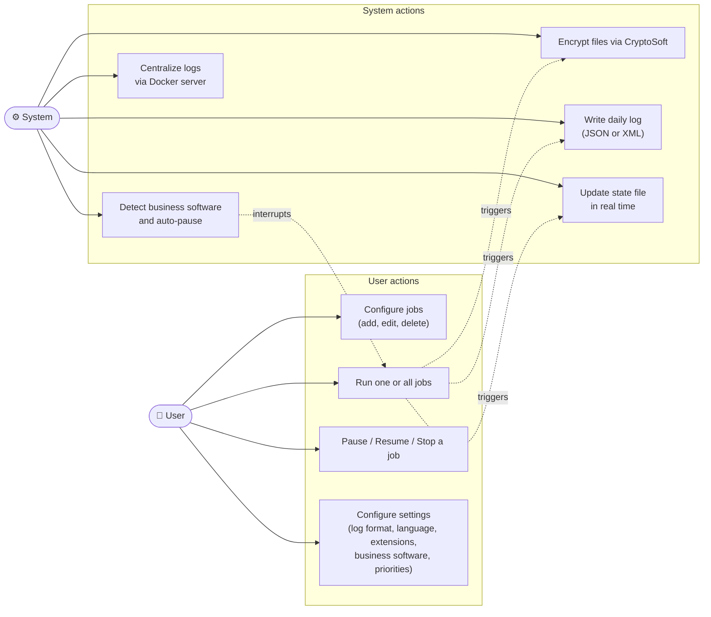
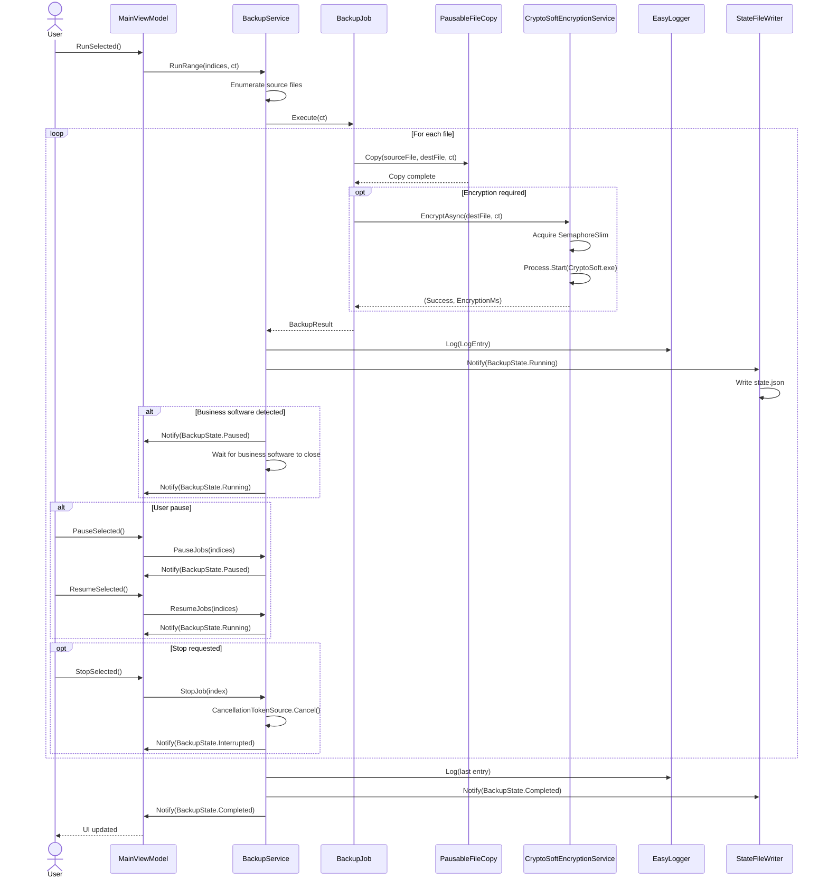
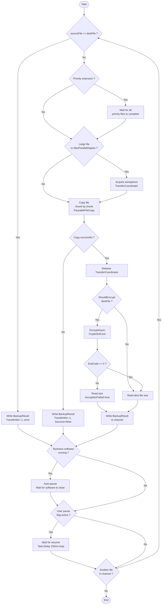

# Release v3.0 — UML Diagrams

## Class diagram

The following diagram represents the complete architecture of EasySave v3.0, organized around the Observer pattern between `BackupService` and its subscribers, and the Strategy pattern for backup and encryption modes.

```mermaid
classDiagram
      namespace EasyLog {
          class LogEntry {
              +Timestamp DateTime
              +BackupName string
              +SourcePath string
              +DestPath string
              +FileSize long
              +TransferMs long
              +EncryptionMs long
              +MachineName string
              +UserName string
          }
          class ILogFormatter {
              <<interface>>
              +FileExtension string
              +Format(List~LogEntry~) string
          }
          class JsonLogFormatter {
              +Format(List~LogEntry~) string
          }
          class XmlLogFormatter {
              +Format(List~LogEntry~) string
          }
          class ILogWriter {
              <<interface>>
              +Log(LogEntry) void
          }
          class EasyLogger {
              -_logDirectory string
              -_formatter ILogFormatter
              +Log(LogEntry) void
          }
          class SocketLogWriter {
              -_host string
              -_port int
              +Log(LogEntry) void
          }
          class CompositeLogWriter {
              -_writers IEnumerable~ILogWriter~
              +Log(LogEntry) void
          }
      }

      namespace EasySave_Models {
          class BackupType {
              <<enumeration>>
              Full
              Differential
          }
          class BackupStatus {
              <<enumeration>>
              Idle
              Running
              Paused
              Completed
              Interrupted
              Error
          }
          class LogFormat {
              <<enumeration>>
              Json
              Xml
          }
          class LogTarget {
              <<enumeration>>
              Local
              Centralized
              LocalAndCentralized
          }
          class BackupJobConfig {
              +Name string
              +SourceDir string
              +TargetDir string
              +Type BackupType
              +IsActive bool
          }
          class BackupState {
              +Name string
              +LastActionTime DateTime
              +Status BackupStatus
              +TotalFiles int
              +TotalSize long
              +RemainingFiles int
              +RemainingSize long
              +Progress float
              +CurrentSource string
              +CurrentDest string
              +LastFileSkipped bool
          }
          class AppSettings {
              +LogFormat LogFormat
              +LogTarget LogTarget
              +CryptoSoftPath string
              +EncryptionKey string
              +EncryptedExtensions List~string~
              +BusinessSoftwareNames List~string~
              +PriorityExtensions List~string~
              +MaxFileSizeForParallelTransferKb long
              +MaxParallelDegree int
          }
          class IStateObserver {
              <<interface>>
              +Update(BackupState) void
          }
      }

      namespace EasySave_Services {
          class IStateSubject {
              <<interface>>
              +Attach(IStateObserver) void
              +Detach(IStateObserver) void
              +Notify(BackupState) void
          }
          class IBackupStrategy {
              <<interface>>
              +Execute(string src, string dst, CancellationToken ct) Task~bool~
          }
          class IBackupJobRepository {
              <<interface>>
              +GetAll() IEnumerable~BackupJobConfig~
              +Save(IEnumerable~BackupJobConfig~) void
          }
          class IAppSettingsRepository {
              <<interface>>
              +Load() AppSettings
              +Save(AppSettings) void
          }
          class IEncryptionService {
              <<interface>>
              +ShouldEncrypt(string) bool
              +Encrypt(string) ValueTuple~bool long~
              +EncryptAsync(string, CancellationToken) Task
          }
          class IBusinessSoftwareGuard {
              <<interface>>
              +IsRunning() bool
          }
          class ITransferCoordinator {
              <<interface>>
              +WaitAsync(string, long, CancellationToken) Task
              +Release(string, long) void
              +RegisterFile(string) void
              +UnregisterFile(string) void
          }
          class IStateFormatter {
              <<interface>>
              +FileExtension string
              +Format(List~BackupState~) string
          }
          class BackupResult {
              <<record>>
              +SourcePath string
              +DestPath string
              +FileSize long
              +TransferMs long
              +Success bool
              +Skipped bool
              +EncryptionMs long
          }
          class BackupService {
              <<Facade>>
              -_pauseFlags ConcurrentDictionary~int bool~
              -_stopCtsSources ConcurrentDictionary~int CTS~
              -_backupJobRepository IBackupJobRepository
              -_logWriter ILogWriter
              -_encryptionService IEncryptionService
              -_guard IBusinessSoftwareGuard
              -_coordinator ITransferCoordinator
              -_getSettings Func~AppSettings~
              +Attach(IStateObserver) void
              +Detach(IStateObserver) void
              +Notify(BackupState) void
              +AddJob(BackupJobConfig) void
              +RemoveJob(int) void
              +UpdateJob(int, BackupJobConfig) void
              +GetJobs() IEnumerable~BackupJobConfig~
              +RunJob(int, CancellationToken) Task
              +RunRange(IEnumerable~int~, CancellationToken) Task
              +PauseJobs(IEnumerable~int~) void
              +ResumeJobs(IEnumerable~int~) bool
              +StopJob(int) void
              +IsJobRunning(int) bool
              +IsGuardRunning() bool
              +ApplyLogSettings() void
          }
          class BackupJob {
              -_config BackupJobConfig
              -_strategy IBackupStrategy
              -_encryptionService IEncryptionService
              -_transferCoordinator ITransferCoordinator
              +Execute(CancellationToken) IAsyncEnumerable~BackupResult~
          }
          class PausableFileCopy {
              +Copy(string src, string dst, CancellationToken ct) Task
          }
          class FullBackupStrategy {
              +Execute(string, string, CancellationToken) Task~bool~
          }
          class DifferentialBackupStrategy {
              +Execute(string, string, CancellationToken) Task~bool~
          }
          class CryptoSoftEncryptionService {
              -_cryptoSemaphore SemaphoreSlim
              -_cryptoSoftPath string
              -_encryptionKey string
              -_encryptedExtensions IReadOnlySet~string~
              +ShouldEncrypt(string) bool
              +Encrypt(string) ValueTuple~bool long~
              +EncryptAsync(string, CancellationToken) Task
          }
          class NoEncryptionService {
              +ShouldEncrypt(string) bool
              +Encrypt(string) ValueTuple~bool long~
              +EncryptAsync(string, CancellationToken) Task
          }
          class ProcessBusinessSoftwareGuard {
              -_processNames IReadOnlyCollection~string~
              +IsRunning() bool
          }
          class NoBusinessSoftwareGuard {
              +IsRunning() bool
          }
          class TransferCoordinator {
              -_largeFileSemaphore SemaphoreSlim
              -_getSettings Func~AppSettings~
              +WaitAsync(string, long, CancellationToken) Task
              +Release(string, long) void
              +RegisterFile(string) void
              +UnregisterFile(string) void
          }
          class StateFileWriter {
              -_statePath string
              -_formatter IStateFormatter
              +Update(BackupState) void
          }
          class JsonStateFormatter {
              +FileExtension string
              +Format(List~BackupState~) string
          }
          class XmlStateFormatter {
              +FileExtension string
              +Format(List~BackupState~) string
          }
          class JsonBackupJobRepository {
              -_configPath string
              +GetAll() IEnumerable~BackupJobConfig~
              +Save(IEnumerable~BackupJobConfig~) void
          }
          class JsonAppSettingsRepository {
              -_path string
              +Load() AppSettings
              +Save(AppSettings) void
          }
      }

      namespace EasySave_Localization {
          class ILocalizationService {
              <<interface>>
              +Get(string key) string
          }
          class ResourceLocalizationService {
              -_resourceManager ResourceManager
              -_culture CultureInfo
              +Get(string key) string
          }
      }

      namespace EasySave_Console {
          class ConsoleObserver {
              -_loc ILocalizationService
              +Update(BackupState) void
          }
          class CommandLineParser {
              +Parse(string[] args) IEnumerable~int~
          }
          class CommandLineRunner {
              -_service BackupService
              -_parser CommandLineParser
              +Run(string[] args) Task
          }
          class InteractiveShell {
              -_service BackupService
              -_loc ILocalizationService
              -_settingsRepo IAppSettingsRepository
              +Run() Task
          }
          class Program {
              <<composition root>>
              +Main(string[] args)$ Task
          }
      }

      namespace EasySave_GUI {
          class ViewModelBase {
              <<abstract>>
              +PropertyChanged event
              #SetProperty() bool
          }
          class RelayCommand {
              +CanExecute(object) bool
              +Execute(object) void
              +RaiseCanExecuteChanged() void
          }
          class MainViewModel {
              -_service BackupService
              -_loc ILocalizationService
              -_settingsRepo IAppSettingsRepository
              -_cts Dictionary~int CTS~
              +Jobs ObservableCollection~BackupJobViewModel~
              +SelectedJobs ObservableCollection~BackupJobViewModel~
              +SelectedJob BackupJobViewModel
              +Settings SettingsViewModel
              +RunSelectedCommand RelayCommand
              +RunAllCommand RelayCommand
              +PauseSelectedCommand RelayCommand
              +ResumeSelectedCommand RelayCommand
              +StopSelectedCommand RelayCommand
              +PauseAllCommand RelayCommand
              +ResumeAllCommand RelayCommand
              +StopAllCommand RelayCommand
              +AddJobCommand RelayCommand
              +UpdateJobCommand RelayCommand
              +RemoveJobCommand RelayCommand
              +Update(BackupState) void
              +ApplyLogSettings() void
          }
          class BackupJobViewModel {
              -_config BackupJobConfig
              +Name string
              +SourceDir string
              +TargetDir string
              +Type BackupType
              +Progress float
              +Status BackupStatus
              +RemainingFiles int
              +CurrentFile string
              +IsPaused bool
              +UpdateFromState(BackupState) void
          }
          class SettingsViewModel {
              -_repo IAppSettingsRepository
              -_settings AppSettings
              +LogFormat LogFormat
              +LogTarget LogTarget
              +SaveCommand RelayCommand
              +ChangeLanguageCommand RelayCommand
          }
          class MainWindow {
              <<View>>
          }
          class BackupJobView {
              <<UserControl>>
          }
          class SettingsView {
              <<UserControl>>
          }
          class GUIProgram {
              <<composition root>>
              +Main(string[] args)$ Task
          }
      }

      namespace EasySave_LogServer {
          class LogServer {
              -_tcpListener TcpListener
              -_logWriter ILogWriter
              +Start(CancellationToken) Task
          }
          class LogServerProgram {
              <<composition root>>
              +Main(string[] args)$ Task
          }
      }

      ILogFormatter <|.. JsonLogFormatter
      ILogFormatter <|.. XmlLogFormatter
      ILogWriter <|.. EasyLogger
      ILogWriter <|.. SocketLogWriter
      ILogWriter <|.. CompositeLogWriter
      EasyLogger --> ILogFormatter
      CompositeLogWriter --> ILogWriter

      IBackupStrategy <|.. FullBackupStrategy
      IBackupStrategy <|.. DifferentialBackupStrategy
      IEncryptionService <|.. CryptoSoftEncryptionService
      IEncryptionService <|.. NoEncryptionService
      IBusinessSoftwareGuard <|.. ProcessBusinessSoftwareGuard
      IBusinessSoftwareGuard <|.. NoBusinessSoftwareGuard
      ITransferCoordinator <|.. TransferCoordinator
      IStateFormatter <|.. JsonStateFormatter
      IStateFormatter <|.. XmlStateFormatter
      IStateObserver <|.. StateFileWriter
      IBackupJobRepository <|.. JsonBackupJobRepository
      IAppSettingsRepository <|.. JsonAppSettingsRepository
      IStateSubject <|.. BackupService
      StateFileWriter --> IStateFormatter
      BackupService --> ILogWriter
      BackupService --> IEncryptionService
      BackupService --> IBusinessSoftwareGuard
      BackupService --> ITransferCoordinator
      BackupService --> IBackupJobRepository
      BackupService --> "0..*" IStateObserver
      BackupService ..> BackupJob
      BackupJob --> IBackupStrategy
      BackupJob --> IEncryptionService
      BackupJob --> ITransferCoordinator
      BackupJob ..> BackupResult
      BackupJob ..> PausableFileCopy

      ILocalizationService <|.. ResourceLocalizationService

      IStateObserver <|.. ConsoleObserver
      ConsoleObserver --> ILocalizationService
      CommandLineRunner --> BackupService
      CommandLineRunner --> CommandLineParser
      InteractiveShell --> BackupService
      InteractiveShell --> ILocalizationService
      InteractiveShell --> IAppSettingsRepository
      Program ..> BackupService
      Program ..> ConsoleObserver
      Program ..> StateFileWriter
      Program ..> InteractiveShell
      Program ..> CommandLineRunner

      IStateObserver <|.. MainViewModel
      ViewModelBase <|-- MainViewModel
      ViewModelBase <|-- BackupJobViewModel
      ViewModelBase <|-- SettingsViewModel
      MainViewModel --> BackupService
      MainViewModel --> ILocalizationService
      MainViewModel --> IAppSettingsRepository
      MainViewModel --> "0..*" BackupJobViewModel
      MainViewModel --> SettingsViewModel
      SettingsViewModel --> IAppSettingsRepository
      MainWindow --> MainViewModel
      BackupJobView --> BackupJobViewModel
      SettingsView --> SettingsViewModel
      GUIProgram ..> BackupService
      GUIProgram ..> StateFileWriter
      GUIProgram ..> MainViewModel
      GUIProgram ..> MainWindow
      GUIProgram ..> ResourceLocalizationService
      GUIProgram ..> JsonAppSettingsRepository

      LogServer --> ILogWriter
      LogServerProgram ..> LogServer
```

## Use case diagram

The diagram below lists the interactions between the user and the EasySave system. System use cases are triggered automatically during the execution of a backup job.

## Sequence diagram

This diagram describes the complete lifecycle of a backup job, from the user action to the completion notification, including file copy, encryption and logging. The `alt` and `opt` blocks cover pause/resume and stop scenarios.

## Activity diagram

This diagram details the internal processing of an individual file in `BackupJob`, from the priority check through to writing the result into the output channel. Business software and user pause flag checks are performed after each processed file.

