# EasySave v1.1 — Class Diagram

```mermaid
classDiagram

    namespace EasyLog {
        class LogEntry {
            +DateTime Timestamp
            +string BackupName
            +string SourcePath
            +string DestPath
            +long FileSize
            +long TransferMs
        }
        class ILogFormatter {
            <<interface>>
            +FileExtension string
            +Format(List~LogEntry~) string
        }
        class JsonLogFormatter {
            +FileExtension string
            +Format(List~LogEntry~) string
        }
        class XmlLogFormatter {
            +FileExtension string
            +Format(List~LogEntry~) string
        }
        class EasyLogger {
            -string _logDirectory
            -ILogFormatter _formatter
            +Log(LogEntry) void
        }
    }

    JsonLogFormatter ..|> ILogFormatter : implements
    XmlLogFormatter ..|> ILogFormatter : implements
    EasyLogger --> ILogFormatter : injects
    EasyLogger ..> LogEntry : uses

    namespace EasySave_Models {
        class BackupType {
            <<enumeration>>
            Full
            Differential
        }
        class BackupStatus {
            <<enumeration>>
            Idle
            Running
            Completed
            Error
        }
        class LogFormat {
            <<enumeration>>
            Json
            Xml
        }
        class BackupJobConfig {
            +string Name
            +string SourceDir
            +string TargetDir
            +BackupType Type
        }
        class BackupState {
            +BackupStatus Status
            +int TotalFiles
            +int RemainingFiles
            +float Progress
            +string CurrentSource
            +string CurrentDest
        }
        class AppSettings {
            +LogFormat LogFormat
        }
        class IStateObserver {
            <<interface>>
            +Update(BackupState) void
        }
    }

    BackupJobConfig --> BackupType
    BackupState --> BackupStatus
    AppSettings --> LogFormat
    IStateObserver ..> BackupState

    namespace EasySave_Services {
        class IStateSubject {
            <<interface>>
            +Attach(IStateObserver) void
            +Detach(IStateObserver) void
            +Notify(BackupState) void
        }
        class IBackupStrategy {
            <<interface>>
            +Execute(string, string) bool
        }
        class IBackupJobRepository {
            <<interface>>
            +GetAll() IEnumerable~BackupJobConfig~
            +Save(IEnumerable~BackupJobConfig~) void
        }
        class IAppSettingsRepository {
            <<interface>>
            +Load() AppSettings
            +Save(AppSettings) void
        }
        class BackupResult {
            <<record>>
            +string SourcePath
            +string DestPath
            +long FileSize
            +long TransferMs
            +bool Skipped
        }
        class BackupJob {
            -BackupJobConfig _config
            -IBackupStrategy _strategy
            +Execute(CancellationToken) IAsyncEnumerable~BackupResult~
        }
        class BackupService {
            <<Facade>>
            -List~IStateObserver~ _observers
            -IBackupJobRepository _repository
            -EasyLogger _logger
            -List~BackupJobConfig~ _jobs
            +AddJob(BackupJobConfig) void
            +RunJob(int, CancellationToken) Task
            +RunRange(IEnumerable~int~, CancellationToken) Task
        }
        class StateFileWriter {
            +Update(BackupState) void
        }
        class FullBackupStrategy {
            +Execute(string, string) bool
        }
        class DifferentialBackupStrategy {
            +Execute(string, string) bool
        }
        class JsonBackupJobRepository {
            +GetAll() IEnumerable~BackupJobConfig~
            +Save(IEnumerable~BackupJobConfig~) void
        }
        class JsonAppSettingsRepository {
            +Load() AppSettings
            +Save(AppSettings) void
        }
    }

    BackupService ..|> IStateSubject : implements
    StateFileWriter ..|> IStateObserver : implements
    FullBackupStrategy ..|> IBackupStrategy : implements
    DifferentialBackupStrategy ..|> IBackupStrategy : implements
    JsonBackupJobRepository ..|> IBackupJobRepository : implements
    JsonAppSettingsRepository ..|> IAppSettingsRepository : implements

    BackupService --> EasyLogger : injects
    BackupService --> IBackupJobRepository : has-field
    BackupService --> IStateObserver : has-field 0..*
    BackupService ..> BackupJob : creates
    BackupService ..> IBackupStrategy : creates
    BackupJob --> BackupJobConfig : injects
    BackupJob --> IBackupStrategy : injects
    BackupJob ..> BackupResult : yields
    IAppSettingsRepository ..> AppSettings

    namespace EasySave_Localization {
        class ILocalizationService {
            <<interface>>
            +Get(string) string
        }
        class ResourceLocalizationService {
            +Get(string) string
        }
    }

    ResourceLocalizationService ..|> ILocalizationService : implements

    namespace EasySave_Console {
        class ConsoleObserver {
            +Update(BackupState) void
        }
        class CommandLineParser {
            +Parse(string[]) IEnumerable~int~
        }
        class CommandLineRunner {
            +Run(string[]) Task
        }
        class InteractiveShell {
            -IAppSettingsRepository _settingsRepo
            -AppSettings _appSettings
            +Run() Task
        }
        class Program {
            <<composition root>>
        }
    }

    ConsoleObserver ..|> IStateObserver : implements
    ConsoleObserver --> ILocalizationService : injects
    CommandLineRunner --> BackupService : injects
    CommandLineRunner --> CommandLineParser : injects
    InteractiveShell --> BackupService : injects
    InteractiveShell --> ILocalizationService : injects
    InteractiveShell --> IAppSettingsRepository : injects
    Program ..> EasyLogger : creates
    Program ..> JsonLogFormatter : creates
    Program ..> XmlLogFormatter : creates
    Program ..> JsonAppSettingsRepository : creates
    Program ..> BackupService : creates
    Program ..> InteractiveShell : creates
    Program ..> CommandLineRunner : creates
```

---

## Delta v1.0 → v1.1

| Classe | Statut | Changement |
|---|---|---|
| `ILogFormatter` | **Nouveau** — EasyLog | Interface de sérialisation des logs |
| `JsonLogFormatter` | **Nouveau** — EasyLog | Implémentation JSON |
| `XmlLogFormatter` | **Nouveau** — EasyLog | Implémentation XML |
| `LogFormat` | **Nouveau** — Models | Enum `Json / Xml` |
| `AppSettings` | **Nouveau** — Models | Contient `LogFormat` |
| `IAppSettingsRepository` | **Nouveau** — Services | Interface de persistance des settings |
| `JsonAppSettingsRepository` | **Nouveau** — Services | Lit/écrit `settings.json` |
| `EasyLogger` | **Modifié** | Reçoit `ILogFormatter` en constructeur |
| `InteractiveShell` | **Modifié** | Option 7 — Settings |
| `Program` | **Modifié** | Charge les settings, résout `ILogFormatter` |
| Tout le reste | Inchangé | — |
