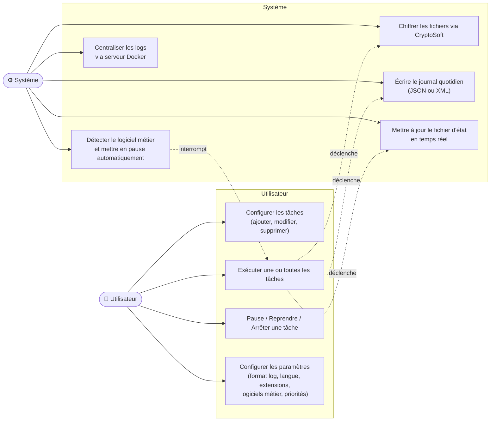
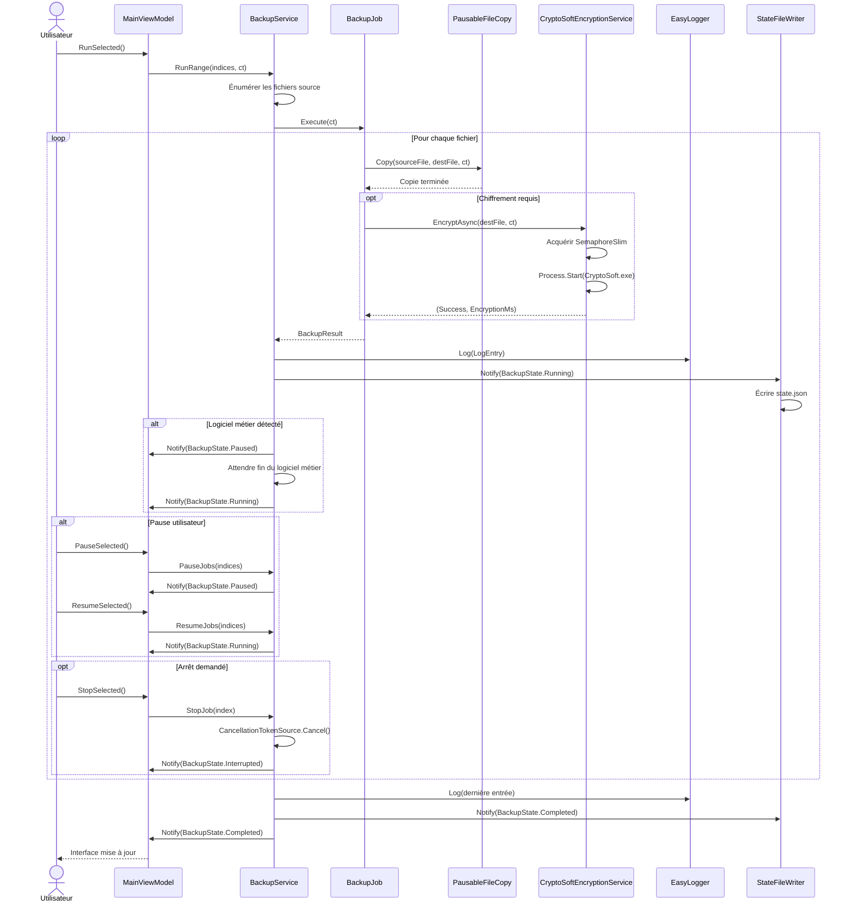
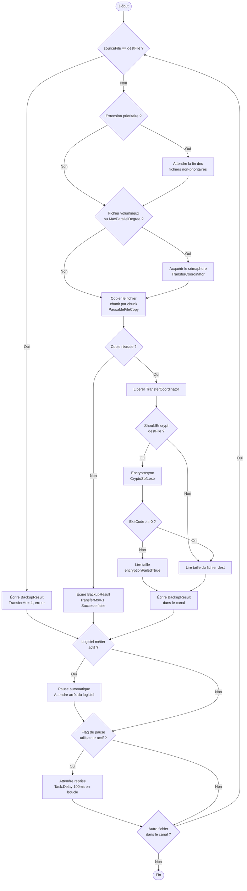

# Release v3.0 — Documentation technique

## Diagramme de classes

Le diagramme suivant représente l'architecture complète d'EasySave v3.0, organisée autour du patron Observateur entre `BackupService` et ses abonnés, et du patron Stratégie pour les modes de sauvegarde et de chiffrement.

```mermaid
classDiagram
      namespace EasyLog {
          class LogEntry {
              +Timestamp DateTime
              +BackupName string
              +SourcePath string
              +DestPath string
              +FileSize long
              +TransferMs long
              +EncryptionMs long
              +MachineName string
              +UserName string
          }
          class ILogFormatter {
              <<interface>>
              +FileExtension string
              +Format(List~LogEntry~) string
          }
          class JsonLogFormatter {
              +Format(List~LogEntry~) string
          }
          class XmlLogFormatter {
              +Format(List~LogEntry~) string
          }
          class ILogWriter {
              <<interface>>
              +Log(LogEntry) void
          }
          class EasyLogger {
              -_logDirectory string
              -_formatter ILogFormatter
              +Log(LogEntry) void
          }
          class SocketLogWriter {
              -_host string
              -_port int
              +Log(LogEntry) void
          }
          class CompositeLogWriter {
              -_writers IEnumerable~ILogWriter~
              +Log(LogEntry) void
          }
      }

      namespace EasySave_Models {
          class BackupType {
              <<enumeration>>
              Full
              Differential
          }
          class BackupStatus {
              <<enumeration>>
              Idle
              Running
              Paused
              Completed
              Interrupted
              Error
          }
          class LogFormat {
              <<enumeration>>
              Json
              Xml
          }
          class LogTarget {
              <<enumeration>>
              Local
              Centralized
              LocalAndCentralized
          }
          class BackupJobConfig {
              +Name string
              +SourceDir string
              +TargetDir string
              +Type BackupType
              +IsActive bool
          }
          class BackupState {
              +Name string
              +LastActionTime DateTime
              +Status BackupStatus
              +TotalFiles int
              +TotalSize long
              +RemainingFiles int
              +RemainingSize long
              +Progress float
              +CurrentSource string
              +CurrentDest string
              +LastFileSkipped bool
          }
          class AppSettings {
              +LogFormat LogFormat
              +LogTarget LogTarget
              +CryptoSoftPath string
              +EncryptionKey string
              +EncryptedExtensions List~string~
              +BusinessSoftwareNames List~string~
              +PriorityExtensions List~string~
              +MaxFileSizeForParallelTransferKb long
              +MaxParallelDegree int
          }
          class IStateObserver {
              <<interface>>
              +Update(BackupState) void
          }
      }

      namespace EasySave_Services {
          class IStateSubject {
              <<interface>>
              +Attach(IStateObserver) void
              +Detach(IStateObserver) void
              +Notify(BackupState) void
          }
          class IBackupStrategy {
              <<interface>>
              +Execute(string src, string dst, CancellationToken ct) Task~bool~
          }
          class IBackupJobRepository {
              <<interface>>
              +GetAll() IEnumerable~BackupJobConfig~
              +Save(IEnumerable~BackupJobConfig~) void
          }
          class IAppSettingsRepository {
              <<interface>>
              +Load() AppSettings
              +Save(AppSettings) void
          }
          class IEncryptionService {
              <<interface>>
              +ShouldEncrypt(string) bool
              +Encrypt(string) ValueTuple~bool long~
              +EncryptAsync(string, CancellationToken) Task
          }
          class IBusinessSoftwareGuard {
              <<interface>>
              +IsRunning() bool
          }
          class ITransferCoordinator {
              <<interface>>
              +WaitAsync(string, long, CancellationToken) Task
              +Release(string, long) void
              +RegisterFile(string) void
              +UnregisterFile(string) void
          }
          class IStateFormatter {
              <<interface>>
              +FileExtension string
              +Format(List~BackupState~) string
          }
          class BackupResult {
              <<record>>
              +SourcePath string
              +DestPath string
              +FileSize long
              +TransferMs long
              +Success bool
              +Skipped bool
              +EncryptionMs long
          }
          class BackupService {
              <<Facade>>
              -_pauseFlags ConcurrentDictionary~int bool~
              -_stopCtsSources ConcurrentDictionary~int CTS~
              -_backupJobRepository IBackupJobRepository
              -_logWriter ILogWriter
              -_encryptionService IEncryptionService
              -_guard IBusinessSoftwareGuard
              -_coordinator ITransferCoordinator
              -_getSettings Func~AppSettings~
              +Attach(IStateObserver) void
              +Detach(IStateObserver) void
              +Notify(BackupState) void
              +AddJob(BackupJobConfig) void
              +RemoveJob(int) void
              +UpdateJob(int, BackupJobConfig) void
              +GetJobs() IEnumerable~BackupJobConfig~
              +RunJob(int, CancellationToken) Task
              +RunRange(IEnumerable~int~, CancellationToken) Task
              +PauseJobs(IEnumerable~int~) void
              +ResumeJobs(IEnumerable~int~) bool
              +StopJob(int) void
              +IsJobRunning(int) bool
              +IsGuardRunning() bool
              +ApplyLogSettings() void
          }
          class BackupJob {
              -_config BackupJobConfig
              -_strategy IBackupStrategy
              -_encryptionService IEncryptionService
              -_transferCoordinator ITransferCoordinator
              +Execute(CancellationToken) IAsyncEnumerable~BackupResult~
          }
          class PausableFileCopy {
              +Copy(string src, string dst, CancellationToken ct) Task
          }
          class FullBackupStrategy {
              +Execute(string, string, CancellationToken) Task~bool~
          }
          class DifferentialBackupStrategy {
              +Execute(string, string, CancellationToken) Task~bool~
          }
          class CryptoSoftEncryptionService {
              -_cryptoSemaphore SemaphoreSlim
              -_cryptoSoftPath string
              -_encryptionKey string
              -_encryptedExtensions IReadOnlySet~string~
              +ShouldEncrypt(string) bool
              +Encrypt(string) ValueTuple~bool long~
              +EncryptAsync(string, CancellationToken) Task
          }
          class NoEncryptionService {
              +ShouldEncrypt(string) bool
              +Encrypt(string) ValueTuple~bool long~
              +EncryptAsync(string, CancellationToken) Task
          }
          class ProcessBusinessSoftwareGuard {
              -_processNames IReadOnlyCollection~string~
              +IsRunning() bool
          }
          class NoBusinessSoftwareGuard {
              +IsRunning() bool
          }
          class TransferCoordinator {
              -_largeFileSemaphore SemaphoreSlim
              -_getSettings Func~AppSettings~
              +WaitAsync(string, long, CancellationToken) Task
              +Release(string, long) void
              +RegisterFile(string) void
              +UnregisterFile(string) void
          }
          class StateFileWriter {
              -_statePath string
              -_formatter IStateFormatter
              +Update(BackupState) void
          }
          class JsonStateFormatter {
              +FileExtension string
              +Format(List~BackupState~) string
          }
          class XmlStateFormatter {
              +FileExtension string
              +Format(List~BackupState~) string
          }
          class JsonBackupJobRepository {
              -_configPath string
              +GetAll() IEnumerable~BackupJobConfig~
              +Save(IEnumerable~BackupJobConfig~) void
          }
          class JsonAppSettingsRepository {
              -_path string
              +Load() AppSettings
              +Save(AppSettings) void
          }
      }

      namespace EasySave_Localization {
          class ILocalizationService {
              <<interface>>
              +Get(string key) string
          }
          class ResourceLocalizationService {
              -_resourceManager ResourceManager
              -_culture CultureInfo
              +Get(string key) string
          }
      }

      namespace EasySave_Console {
          class ConsoleObserver {
              -_loc ILocalizationService
              +Update(BackupState) void
          }
          class CommandLineParser {
              +Parse(string[] args) IEnumerable~int~
          }
          class CommandLineRunner {
              -_service BackupService
              -_parser CommandLineParser
              +Run(string[] args) Task
          }
          class InteractiveShell {
              -_service BackupService
              -_loc ILocalizationService
              -_settingsRepo IAppSettingsRepository
              +Run() Task
          }
          class Program {
              <<composition root>>
              +Main(string[] args)$ Task
          }
      }

      namespace EasySave_GUI {
          class ViewModelBase {
              <<abstract>>
              +PropertyChanged event
              #SetProperty() bool
          }
          class RelayCommand {
              +CanExecute(object) bool
              +Execute(object) void
              +RaiseCanExecuteChanged() void
          }
          class MainViewModel {
              -_service BackupService
              -_loc ILocalizationService
              -_settingsRepo IAppSettingsRepository
              -_cts Dictionary~int CTS~
              +Jobs ObservableCollection~BackupJobViewModel~
              +SelectedJobs ObservableCollection~BackupJobViewModel~
              +SelectedJob BackupJobViewModel
              +Settings SettingsViewModel
              +RunSelectedCommand RelayCommand
              +RunAllCommand RelayCommand
              +PauseSelectedCommand RelayCommand
              +ResumeSelectedCommand RelayCommand
              +StopSelectedCommand RelayCommand
              +PauseAllCommand RelayCommand
              +ResumeAllCommand RelayCommand
              +StopAllCommand RelayCommand
              +AddJobCommand RelayCommand
              +UpdateJobCommand RelayCommand
              +RemoveJobCommand RelayCommand
              +Update(BackupState) void
              +ApplyLogSettings() void
          }
          class BackupJobViewModel {
              -_config BackupJobConfig
              +Name string
              +SourceDir string
              +TargetDir string
              +Type BackupType
              +Progress float
              +Status BackupStatus
              +RemainingFiles int
              +CurrentFile string
              +IsPaused bool
              +UpdateFromState(BackupState) void
          }
          class SettingsViewModel {
              -_repo IAppSettingsRepository
              -_settings AppSettings
              +LogFormat LogFormat
              +LogTarget LogTarget
              +SaveCommand RelayCommand
              +ChangeLanguageCommand RelayCommand
          }
          class MainWindow {
              <<View>>
          }
          class BackupJobView {
              <<UserControl>>
          }
          class SettingsView {
              <<UserControl>>
          }
          class GUIProgram {
              <<composition root>>
              +Main(string[] args)$ Task
          }
      }

      namespace EasySave_LogServer {
          class LogServer {
              -_tcpListener TcpListener
              -_logWriter ILogWriter
              +Start(CancellationToken) Task
          }
          class LogServerProgram {
              <<composition root>>
              +Main(string[] args)$ Task
          }
      }

      ILogFormatter <|.. JsonLogFormatter
      ILogFormatter <|.. XmlLogFormatter
      ILogWriter <|.. EasyLogger
      ILogWriter <|.. SocketLogWriter
      ILogWriter <|.. CompositeLogWriter
      EasyLogger --> ILogFormatter
      CompositeLogWriter --> ILogWriter

      IBackupStrategy <|.. FullBackupStrategy
      IBackupStrategy <|.. DifferentialBackupStrategy
      IEncryptionService <|.. CryptoSoftEncryptionService
      IEncryptionService <|.. NoEncryptionService
      IBusinessSoftwareGuard <|.. ProcessBusinessSoftwareGuard
      IBusinessSoftwareGuard <|.. NoBusinessSoftwareGuard
      ITransferCoordinator <|.. TransferCoordinator
      IStateFormatter <|.. JsonStateFormatter
      IStateFormatter <|.. XmlStateFormatter
      IStateObserver <|.. StateFileWriter
      IBackupJobRepository <|.. JsonBackupJobRepository
      IAppSettingsRepository <|.. JsonAppSettingsRepository
      IStateSubject <|.. BackupService
      StateFileWriter --> IStateFormatter
      BackupService --> ILogWriter
      BackupService --> IEncryptionService
      BackupService --> IBusinessSoftwareGuard
      BackupService --> ITransferCoordinator
      BackupService --> IBackupJobRepository
      BackupService --> "0..*" IStateObserver
      BackupService ..> BackupJob
      BackupJob --> IBackupStrategy
      BackupJob --> IEncryptionService
      BackupJob --> ITransferCoordinator
      BackupJob ..> BackupResult
      BackupJob ..> PausableFileCopy

      ILocalizationService <|.. ResourceLocalizationService

      IStateObserver <|.. ConsoleObserver
      ConsoleObserver --> ILocalizationService
      CommandLineRunner --> BackupService
      CommandLineRunner --> CommandLineParser
      InteractiveShell --> BackupService
      InteractiveShell --> ILocalizationService
      InteractiveShell --> IAppSettingsRepository
      Program ..> BackupService
      Program ..> ConsoleObserver
      Program ..> StateFileWriter
      Program ..> InteractiveShell
      Program ..> CommandLineRunner

      IStateObserver <|.. MainViewModel
      ViewModelBase <|-- MainViewModel
      ViewModelBase <|-- BackupJobViewModel
      ViewModelBase <|-- SettingsViewModel
      MainViewModel --> BackupService
      MainViewModel --> ILocalizationService
      MainViewModel --> IAppSettingsRepository
      MainViewModel --> "0..*" BackupJobViewModel
      MainViewModel --> SettingsViewModel
      SettingsViewModel --> IAppSettingsRepository
      MainWindow --> MainViewModel
      BackupJobView --> BackupJobViewModel
      SettingsView --> SettingsViewModel
      GUIProgram ..> BackupService
      GUIProgram ..> StateFileWriter
      GUIProgram ..> MainViewModel
      GUIProgram ..> MainWindow
      GUIProgram ..> ResourceLocalizationService
      GUIProgram ..> JsonAppSettingsRepository

      LogServer --> ILogWriter
      LogServerProgram ..> LogServer
```

## Diagramme de cas d'utilisation

Le diagramme ci-dessous recense les interactions entre l'utilisateur et le système EasySave. Les cas d'utilisation système sont déclenchés automatiquement lors de l'exécution d'une tâche de sauvegarde.

## Diagramme de séquence

Ce diagramme décrit le cycle de vie complet d'une tâche de sauvegarde, de l'action utilisateur jusqu'à la notification de fin, en passant par la copie, le chiffrement et la journalisation. Les blocs `alt` et `opt` couvrent les cas de pause/reprise et d'arrêt.

## Diagramme d'activité

Ce diagramme détaille le traitement interne d'un fichier individuel dans `BackupJob`, depuis la vérification de priorité jusqu'à l'écriture du résultat dans le canal de sortie. Les contrôles du logiciel métier et du flag de pause sont effectués après chaque fichier traité.

